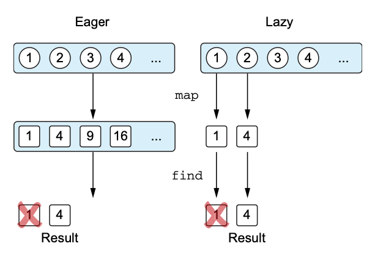
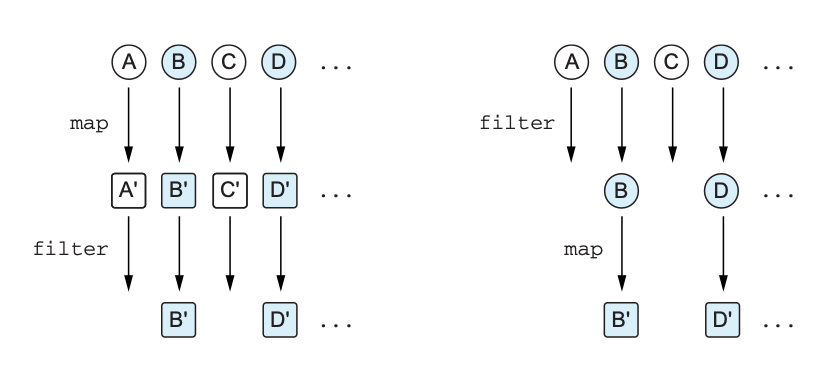

# 5장 람다로 프로그래밍

## 5.1 람다 식과 멤버 참조

### 5.1.1 람다 소개: 코드 블록을 함수 인자로 넘기기
아래와 같은 경우
- "이벤트가 발생하면 이 핸들러를 실행하자"
- "데이터 구조의 모든 원소에 이 연산을 적용하자"
  -> 자바에서는 무명 내부 클래스를 사용
  -> 함수형 프로그래밍에서는 함수를 직접 다른 함수에 전달

- 람다를 메서드가 하나뿐인 무명 객체 대신 사용할 수 있다

### 5.1.2 람다와 컬렉션
- 변수를 많이 선언하고 리스트에 대한 이터레이션을 하면서 컬렉션을 검색하면 실수를 저지르기 쉬움
- 코틀린 라이브러리 함수를 사용하여 위 부작용 방지 가능

**멤버참조**
```kotlin
people.maxBy(Person::age) // == people.maxBy {it.age}
```
- 자바8 이전에 수행하던 대부분의 작업은 람다나 멤버 참조를 인수로 취하는 라이브러리를 통해 해결 가능

### 5.1.3 람다 식의 문법
- 람다는 값처럼 여기저기 전달할 수 있는 동작의 모음
```kotlin
{ x: Int, y: Int -> x + y }
//<--파라미터---->   <-본문->
// 중괄호 사이에 위치
```
- 코틀린 람다 식은 항상 중괄호로 감싸짐
- 인자 목록 주변에 괄호가 없음
- 화살표가 인자 목록과 람다 본문을 구분
- 람다 식을 변수에 저장 가능
```kotlin
val sum = { x: Int, y: Int -> x + y }
println(sum(1, 2))
// 출력: 3
```
- 코드의 일부분을 블록으로 둘러싸 실행해야 한다면 `run` 사용
```kotlin
run { println(42) }
// 출력: 42
```

**점진적 개선**
```kotlin
// 정식
people.maxBy({ p: Person -> p.age })

// 개선1. 코틀린 관습으로 괄호를 밖으로 뺌
people.maxBy() { p: Person -> p.age }

// 개선2. 람다가 함수의 유일한 인자면서 괄호뒤 람다라면 괄호 생략 가능
people.maxBy { p: Person -> p.age }

// 개선3. '람다 파라미터 타입' 추론을 통한 제거
people.maxBy { p -> p.age }

// 개선4. 람다 파라미터가 하나뿐이고 그 타입을 컴파일러가 추론 가능하다면 디폴트 이름 it 사용
people.maxBy { it.age }
```
- 람다 중첩 시 각 람다의 파라미터 명시 추천
- 람다를 변수에 저장할 때는 추론할 문맥이 없기 때문에 타입명시

### 5.1.4 현재 영역에 있는 변수에 접근
- 람다를 함수 안에서 정의 시 람자 정의의 앞에 선언된 로컬 변수를 람다에서 사용 가능
- 자바는 파이널 변수만을 람다안에서 사용 가능, 하지만 코틀린은 가변변수도 람다 내에서 사용 가능
- 람다를 이벤트 핸들러나 다른 비동기적으로 실행되는 코드로 활용하는 경우 함수 호출이 끝난 후 로컬 변수가 변경 될 수 있음
```kotlin
fun tryToCountButtonClicks(button: Button) {
	var clicks = 0
	button.onClick { clicks++ }
	return clicks
}
// 위 함수는 항상 0반환
// 핸들러는 tryToCountButtonClicks가 clicks를 반환한 후 호출되기 때문
```

### 5.1.5 멤버 참조
- 멤버 참조는 프로퍼티나 메서드를 단 하나만 호출하는 함수 값을 만듦
```kotlin
Person::age
//클래스  멤버

// 위 문법은 아래 람다를 간단하게 표현한 것
val getAge = { person: Person -> person.age} 

// 최상위 함수나 프로퍼티 참조 가능
fun salute() = println("salute!")
run(::salute)
```
- 생성자 참조 사용 시 클래스 생성 작업을 연기하거나 저장 가능
```kotlin
val createPerson = ::Person
val p = createPerson("Alice",29)
println(p)
// 출력: Person(name=Alice, age=29)
```

## 5.2 컬렉션 함수형 API
### 5.2.1 필수적인 함수: filter와 map
- `filter` 함수는 주어진 술어를 만족하는 원소만으로 이루어진 새로운 컬렉션을 반환
- **원소를 변환**하려면 `map` 함수 사용
- 맵 자료구조의 경우 키와 값을 처리하는 함수 따로 존재
    - filterKey, mapKey, filterValues, mapValues

### 5.2.2 all, any, count, find: 컬렉션에 술어 적용
- 모든 원소가 이 술어를 만족하는지 판단 시 `all` 함수 사용
- 술어를 만족하는 원소가 하나라도 있는지 판단 시 `any` 함수 사용
- 술어를 만족하는 원소의 개수 구할 시 `count` 함수 사용
- 술어를 만족하는 원소를 하나 찾을 시 `find` 함수 사용
    - 가장 먼저 조건을 만족하는 원소 반환, 없을 시 null 반환 == `firstOrNull()`

### 5.2.3 groupBy: 리스트를 여러 그룹으로 이뤄진 맵으로 변경
- 리스트를 `groupBy`시 `Map<Foo, List<Bar>>` 형태로  반환

### 5.2.4 flatMap과 flatten: 중첩된 컬렉션 안의 원소 처리
- flatMap 함수는 주어진 람다를 컬렉션의 모든 객체에 적용(map), 이후 람다 적용결과 얻어지는 여러 리스트를 한 리스트로 취합(flatten)
- 특별히 변환해야 할 내용이 없다면 리스트의 리스트를 평평하게 펼치는 `flatten()` 함수 사용

## 5.3 지연 계산(lazy) 컬렉션 연산
- 컬렉션 함수 연쇄 시 매 단계 새로운 컬렉션에 임시로 저장
- 시퀀스는 임시 컬렉션 사용하지 않음
```kotlin
people.asSequence() // 원본 컬렉션을 시퀀스로 변환
	.map(Person::name)
	.filter { it.startsWith("A") } // 시퀀스는 컬렉션과 동일한 API 제공
	.toList() // 결과를 다시 리스트로 변환
```
- `Sequence`안 `iterator`메서드 존재. 이 메서드를 통해 시퀀스로부터 원소 값 얻음

### 5.3.1 시퀀스 연산 실행: 중간 연산과 최종 연산
- 시퀀스 연산은 중간 연산과 최종 연산으로 나뉨
```kotlin
sequence.map {...}.filter {...}.toList()
//       <------중간연산---------><-최종연산->
```
- 중간 연산은 항상 지연계산
- 최종 연산시 연기됐던 모든 계산 수행
- 시퀀스 사용시지연 계산으로 인해 원소 중 일부 계산은 생략
  
- 컬렉션에 대해 수행하는 연산 순서가 성능에 영향을 끼침

**예시: filter를 먼저 적용하여 전체 변환 횟수가 줄어듬**



### 5.3.2 시퀀스 만들기
- `generateSequence`를 통해 시퀀스 생성 가능
```kotlin
val naturalNumbers = generateSequence(0) { it + 1 } 
val numbersTo100 = naturalNumbers.takeWhile{ it <= 100 }
println(numbersTo100.sum())
// 출력: 5050
```
- 위 예제에서는 `naturalNumbers`와 `numbersTo100` 모두 시퀀스, 연산을 지연 계산
- 최종 연산인 `sum()` 호출 시 각 숫자가 계산됨

## 5.4 자바 함수형 인터페이스 활용
- 코틀린에서는 무명 클래스 인스턴스 대신 람다를 넘길 수 있음
- 추상 메서드가 하나만 있는 인터페이스를 `함수형 인터페이스` 또는 `SAM 인터페이스` 라고 함

### 5.4.1 자바 메서드에 람다를 인자로 전달
**자바**로 되어있는 함수를
```java
void postponeComputation(int delay, Runnable computation);
```
**코틀린**에서 아래와 같이 호출 가능
```kotlin
postponeComputation(1000) { println(42) }
```
- 위 예제에서 코틀린 컴파일러가 자동으로 람다를 `Runnable` 무명클래스와 인스턴스 생성
- 무명 객체를 명시적으로 생성 가능
```kotlin
postponeComputation(1000, object: Runnable {
	override fun run() {
		println(42)
	}
})
```
- 이 경우 메서드 호출 시마다 새로운 객체 생성
- 람다는 함수의 변수에 접근하지 않는 람다에 대응하는 무명 객체를 메서드 호출 시마다 재사용
- 하지만 람다가 주변 영역 변수를 캡쳐시 매 호출마다 인스턴스를 재사용할 수 없고 새로운 인스턴스 생성

### 5.4.2 SAM 생성자: 람다를 함수형 인터페이스로 명시적으로 변경
- 컴파일러가 자동으로 람다를 함수형 인터페이스 무명 클래스로 변환 불가한 경우 SAM 생성자 사용 가능

**SAM 생성자 사용하여 값 반환**
```kotlin
fun createAllDoneRunnable(): Runnable {
	return Runnable { println("All Done!") }
}
createAllDoneRunnable().run()
// 출력: All Done!
```
- SAM 생성자는 함수형 인터페이스의 유일한 추상메서드의 본문에 사용할 람다만을 인자로 받음
    - 그 후 함수영 인터페이스를 구현하는 클래스의 인스턴스를 반환

**SAM 생성자 사용하여 listener 인스턴스 재사용**
```kotlin
val listener = OnClickListener { view ->
	val text = when (view.id) {
		R.id.button1 -> "First Button"
		R.id.button2 -> "Second Button"
		else -> "Unknown button"
	}
	toast(text)
}

button1.setOnClickListener(listener)
button2.setOnClickListener(listener)
```

## 5.5 수신 객체 지정 람다: with와 apply
### 5.5.1 with 함수
```kotlin
fun alphabet(): String {
	val result = StringBuilder()
	for (letter in 'A'..'Z') {
		result.append(letter)
	}
	result.append("\nNow I know the alphabet!")
	return result.toString()
}
println(alphabet())
// 출력:
// ABCDEFGHIJKLMNOPQRSTUVWXYZ
// Now I know the alphabet!
```
- 코드가 훨씬 길거나 `result`를 더 자주 반복한다면 불편
- 위 코드를 아래와 같이 변환 가능
```kotlin
fun alphabet(): String {
	val stringBuilder = StringBuilder()
	return with(stringBuilder) { // 메서드 호출하려는 수신객체 지정
		for (letter in 'A'..'Z') {
			this.append(letter) // this 명시하여 수신객체 메서드 호출
		}
		append("\nNow I know the alphabet!") // this 생략 가능
		this.toString() // 람다에서 값을 반환
	}
}
println(alphabet())
// 출력:
// ABCDEFGHIJKLMNOPQRSTUVWXYZ
// Now I know the alphabet!
```
- `with`는 파라미터가 2개 있는 함수.
- 첫 번째 파라미터는 `stringBuilder`, 두 번째 파라미터는 람다
- 아래처럼 식으로 가능
```kotlin
fun alphabet() = with(StringBuilder()) {
	for (letter in 'A'..'Z') {
		append(letter)
	}
	append("\nNow I know the alphabet!")
	toString()
}
```

### 5.5.2 apply 함수
- 람다의 결과보다 수신객체가 필요한 경우 사용
- 항상 자신에게 전달된 객체를 반환(수신객체를 반환)
```kotlin
fun alphabet() = StringBuilder().apply {
	for (letter in 'A'..'Z') {
		append(letter)
	}
	append("\nNow I know the alphabet!")
}.toString()
```
- 즉시 프로퍼티 중 일부를 초기화해야 하는 경우 유용

**apply를 TextView 초기화에 사용**
```kotlin
fun createViewWithCustomAttributes(context: Context) =
	TextView(context).apply {
		text = "Sample Text"
		textSize = 20.0
		setPadding(10, 0, 0, 0)
	}
```
- apply 함수 사용 시 본문에 간결한 식 사용 가능

**수신객체지정람다 인 표준함수 `buildString` 사용**
```kotlin
fun alphabet() = buildString {
	for (letter in 'A'..'Z') {
		append(letter)
	}
	append("\nNow I know the alphabet!")
}
```
- `buildString`은 `StringBuilder` 생성과 `toString` 을 대신 호출