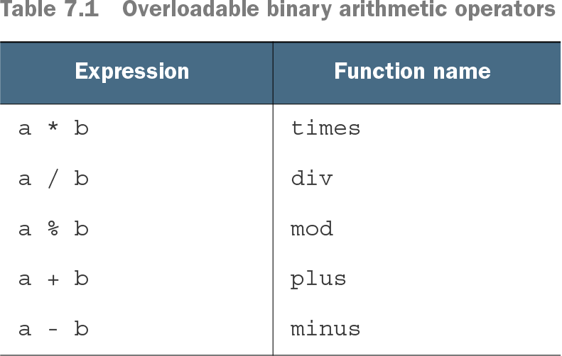
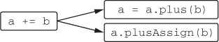

# 7장 연산자 오버로딩과 기타 관례

- 클래스 안에 plus 라는 이름의 특별한 메서드를 정의하면 그 클래스 인스턴스에 대해 + 연산자 사용 가능
- 이런식으로 어떤 언어 기능과 미리 정해진 이름의 함수를 연결해주는 기법을 코틀린에서는 **관례** 라고 함
- 기존 자바 클래스에 대해 확장 함수를 구현하면서 관례에 따라 이름을 붙이면 기존 자바 코드를 바꾸지 않아도 새로운 기능 부여 가능

## 7.1 산술 연산자 오버로딩
### 7.1.1 이항 산술 연산 오버로딩
- 두점을 더하는 연산
```kotlin
data class Point(val x: Int, val y: Int) {
    operator fun plus(other: Point): Point {                      
        return Point(x + other.x, y + other.y)                    
    }
}
>>> val p1 = Point(10, 20)
>>> val p2 = Point(30, 40)
>>> println(p1 + p2)                                             
Point(x=40, y=60)
```
- plus 함수 앞에 operator 키워드 추가 필수
  - 연산자 오버로딩 함수 앞에는 operator 키워드 필수  
- plus 함수 선언 후 + 기호로 두 Point 객체를 더하는 것이 가능
- 연산자를 멤버 함수로 만드는 대신 확장 함수로도 정의 가능
```kotlin
data class Point(val x: Int, val y: Int)

operator fun Point.plus(other: Point): Point {
    return Point(x + other.x, y + other.y)
}

fun main(args: Array<String>) {
    val p1 = Point(10, 20)
    val p2 = Point(30, 40)
    println(p1 + p2)
}
```
**오버로딩 가능한 이항 산술 연산자**


- 두 피연산자가 같은 타입일 필요는 없음
- 코틀린 연산자가 자동으로 교환 법칙을 지원하지 않음
  - p * 1.5 라는 연산 외에도 1.5 * p 로도 써야 한다면 `operator fun Double.times(p: Point)..` 작성 필요
- 결과 타입이 피연산자 타입과 다른 연산자도 정의 가능
  - `operator fun Char.times(count: Int): String ..`
- operator 함수도 오버로딩할 수 있음, 이름은 같지만 파라미터 타입이 서로 다른 연산자 함수를 다양하게 생성 가능

### 7.1.2 복합 대입 연산자 오버로딩
- 연산자를 오버로딩하면 그와 관련된 복합 대입 연산자도 함께 지원
- 변수가 변경 가능한 경우에만 복합 대입 연산자 사용 가능
  - += 연산은 참조를 다른 참조로 바꿔치기 함
- 바꿔치기가 아닌 상태를 바꾸고 싶다면 반환 타입이 Unit 인 plusAssign 함수를 정의
- 코틀린은 mutable 컬렉션에 대해 plusAssign을 정의한다.
- plus와 plusAssign 연산을 동시에 정의하지 말 것
  - 
  - += 연산자는 plus 또는 plusAssign 함수 호출로 번역할 수 있다.
- 코틀린은 컬렉션에 대해 두 가지 접근 방법을 함께 제공
  - +와 -는 항상 새로운 컬렉션을 반환
  - += 와 -= 연산자는 항상 변경 가능한 컬렉션에 작용하여 메모리에 있는 객체 상태를 변화
  - 읽기 전용 컬렉션에서 +=와 -=는 변경을 적용한 복사본을 반환
    - var 선언한 변수가 가리키는 읽기 전용 컬렉션에서만 +=와 -=적용 가능

### 7.1.3 단항 연산자 오버로딩
```kotlin
operator fun Point.unaryMinus(): Point {           
    return Point(-x, -y)                           
}
>>> val p = Point(10, 20)
>>> println(-p)
Point(x=-10, y=-20)
```
- 단항 함수는 파라미터가 없음
- 증가/감소 연산자를 오버로딩하면 전위, 후위 연산 자동 지원한다
```kotlin
operator fun BigDecimal.inc() = this + BigDecimal.ONE
>>> var bd = BigDecimal.ZERO
>>> println(bd++)                                  
0
>>> println(++bd)                                  
2
```

## 7.2 비교 연산자 오버로딩
### 7.2.1 동등성 연산자: equals
- 코틀린은 ==연산자 호출을 equals 메서드 호출로 컴파일
- != 연산자를 사용하는 식도 equals 호출로 컴파일
- ==와 !=는 내부에서 인자가 널인지 검사.
  - nullable 값에도 적용 가능
- 식별자 비교 연산자(===)을 사용해 equals의 파라미터가 수신 객체와 같은지 확인
  - 식별자 비교 연산자는 자바의 == 연산자와 동일.
  - ===를 오버로딩할 수 없다
- Any의 equals에는 operator가 붙어 있지만 그 메서드를 오버라이드하는 메서드 앞에는 opeator 변경자를 붙이지 않다고 자동으로 상위 클래스의 operator 가 적용
- Any에서 상속받은 equals가 확장 함수보다 우선순위가 높기 때문에 equals를 확장 함수로 정의할 수 없다

### 7.2.2 순서 연산자: compareTo
- 자바에서는 `<` 또는 `>` 연산자로는 원시 타입의 값만 비교 가능
  - 다른 모든 타입의 값에는 `element1.compareTo(element2)`를 명시적으로 사용
- 코틀린도 Comparable 인터페이스를 지원하고, compareTo 메서드를 호출하는 관례를 제공
  - 따라서 비교 연산자 호출시 compareTo 호출로 컴파일
- Comparable 인터페이스를 코틀린뿐 아니라 자바 쪽의 컬렉션 정렬 메서드 등에도 사용 가능
- equals와 마찬가지로 Comparable의 compareTo에도 operator 변경자가 붙어있어 하위클래스의 오버라이딩 함수에 operator를 붙이지 않아도 됨
- Compareable 인터페이스를 구현하는 모든 자바 클래스를 코틀린에서 간결한 연산자 구문으로 비교 가능
  - `println("abc" < "bac")`