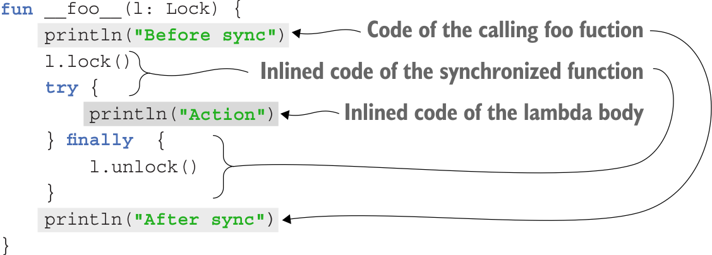

# 8장 고차 함수: 파라미터와 반환 값으로 람다 사용
- 람다를 인자로 받거나 반환하는 함수인 고차 함수를 만드는 방법을 다룬다
- 람다를 사용하며 생기는 부가 비용을 없애고 람다 내에서 더 유연하게 흐름을 제어할 수 있는 인라인 함수에 대해 배운다

## 8.1 고차 함수 정의
- **고차 함수**: 람다나 함수 참조를 인자로 넘길 수 있거나 람다나 함수 참조를 반환 하는 함수

### 8.1.1 함수 타입
```kotlin
val sum: (Int, Int) -> Int = { x, y -> x + y }                // int 파라미터를 2개 받아 int 값을 반환
val action: () -> Unit = { println(42) }                      // 아무 파라미터도 받지 않고 아무 값도 반환하지 않음
```
**함수 타입을 정의하는 방법**
```kotlin
(Int, String) -> Unit
  파라미터 타입     반환타입
```
- 함수 타입을 선언할 때는 반환 타입을 반드시 명시해야 한다
- 변수 타입을 함수 타입으로 지정하면 람다 식 안에서 굳이 파라미터 타입을 적을 필요가 없다
- 널이 될 수 있는 함수 타입 변수를 정의하기 위해선 함수 타입을 괄호로 감싸고 그 뒤에 물음표를 붙여야 한다

### 8.1.2 인자로 받은 함수 호출
- 인자로 받은 함수를 호출하는 구문은 일반함수와 동일하다
  - 함수 이름 뒤 괄호를 붙이고 괄호 안에 원하는 인자를 콤마로 구분해 넣는 것
```kotlin
fun twoAndThree(operation: (Int, Int) -> Int) {
    val result = operation(2, 3)
    println("The result is $result")
}
twoAndThree { a, b -> a + b }
// The result is 5
twoAndThree { a, b -> a * b }
// The result is 6
```
**filter 함수를 단순하게 만든 버전**
```kotlin
fun String.filter(predicate: (Char) -> Boolean): String { 
    val sb = StringBuilder()
        for (index in indices) {
            val element = get(index)
            if (predicate(element)) {
                sb.append(element)
            }
        }
    return sb.toString()
}
println("ab1c".filter { it in 'a'..'z' })
// abc
```

### 8.1.3 자바에서 코틀린 함수 타입 사용
```kotlin
// 코틀린
fun processTheAnswer(f: (Int) -> Int) {
    println(f(42))
}
```
```java
// 자바
processTheAnswer(number -> number + 1);
```

### 8.1.4 디폴트 파라미터로 지정한 함수 타입 파라미터나 널이 될 수 있는 함수 타입 파라미터
**하드 코딩을 통해 toString 사용 관례를 따르는 joinToString**
```kotlin
fun <T> Collection<T>.joinToString(
    separator: String = ", ",
    prefix: String = "",
    postfix: String = "",
): String {
    val result = StringBuilder(prefix)
    for ((index, element) in this.withIndex()) {
        if (index > 0) result.append(separator)
        result.append(element) // 기본 toString 메서드 사용
    }
    result.append(postfix)
    return result.toString()
}
```
**함수 타입의 파라미터에 디폴트 값 지정하기**
```kotlin
fun <T> Collection<T>.joinToString(
    separator: String = ", ",
    prefix: String = "",
    postfix: String = "",
    transform: (T) -> String = { it.toString() }, // 함수 타입 파라미터를 선언하면서 람다를 디폴트 값으로 지정
): String {
    val result = StringBuilder(prefix)
    for ((index, element) in this.withIndex()) {
        if (index > 0) result.append(separator)
        result.append(transform(element)) // transform 파라미터로 받은 함수를 호출 
    }
    result.append(postfix)
    return result.toString()
}
```
**널이 될 수 있는 함수 타입 파라미터 사용하기**
```kotlin
fun <T> Collection<T>.joinToString(
    separator: String = ", ",
    prefix: String = "",
    postfix: String = "",
    transform: ((T) -> String)? = null, // 널이 될 수 있는 함수 타입의 파라미터 
): String {
    val result = StringBuilder(prefix)
    for ((index, element) in this.withIndex()) {
        if (index > 0) result.append(separator)
        val str = transform?.invoke(element) ?: element.toString() // 세이프콜을 사용해 함수 호출
        result.append(str) 
    }
    result.append(postfix)
    return result.toString()
}
```

### 8.1.5 함수를 함수에서 반환
**함수를 반환하는 함수 정의**
```kotlin
enum class Delivery { STANDARD, EXPEDITED }

class Order(val itemCount: Int)

fun getShippingCostCalculator(delivery: Delivery): (Order) -> Double {
    if (delivery == Delivery.EXPEDITED) {
        return { order -> 6 + 2.1 * order.itemCount }
    }
    return { order -> 1.2 * order.itemCount }
}

val calculator = getShippingCostCalculator(Delivery.EXPEDITED)
println("Shipping costs ${calculator(Order(3))}")
// Shipping costs 12.3
```

### 8.1.6 람다를 활용한 중복 제거
**웹사이트 방문 기록 예**
```kotlin
data class SiteVisit(
    val path: String,
    val duration: Double,
    val os: OS
)

enum class OS { WINDOWS, LINUX, MAC, IOS, ANDROID }

val log = listOf(
    SiteVisit("/", 34.0, OS.WINDOWS),
    SiteVisit("/", 22.0, OS.MAC),
    SiteVisit("/login", 12.0, OS.WINDOWS),
    SiteVisit("/signup", 8.0, OS.IOS),
    SiteVisit("/", 16.3, OS.ANDROID),
)

// 사이트 방문 데이터 하드 코딩한 필터 사용하여 분석
val averageWindowsDuration = log
    .filter { it.os == OS.WINDOWS }
    .map(SiteVisit::duration)
    .average()
println(averageWindowsDuration)
// 23.0
```
**일반 함수로 중복 제거**
```kotlin
fun List<SiteVisit>.averageDurationFor(os: OS) = 
    filter { it.os == os }.map(SiteVisit::duration).average()
println(log.averageDurationFor(OS.WINDOWS))
// 23.0
println(log.averageDurationFor(OS.MAC))
// 22.0
```
**복잡하게 하드 코딩한 필터 사용하여 데이터 분석**
```kotlin
val averageMobileDuration = log
    .filter { it.os in setOf(OS.IOS, OS.ANDROID) }
    .map(SiteVisit::duration)
    .average()

println(averageMobileDuration)
//12.15
```
**고차 함수를 사용해 중복 제거**
```kotlin
fun List<SiteVisit>.averageDurationFor(predicate: (SiteVisit) -> Boolean) =
    filter(predicate).map(SiteVisit::duration).averate()

println(log.averageDurationFor { it.os == OS.IOS && it.path == "/signup" })
// 8.0
```
- 전략패턴 관련
  - 함수 타입을 언어가 지원하면 일반 함수 타입을 사용해 전략을 표현할 수 있고 경우에 따라 다른 람다식을 넘겨 여러 전략을 전달할 수 있다

## 8.2 인라인 함수: 람다의 부가 비용 없애기
- inline 변경자를 어떤 함수에 붙이면 컴파일러는 그 함수를 호출하는 모든 문장을 함수 본문에 해당하는 바이트 코드로 바꿔치기 한다
  - **이유**:
    - 람다식을 사용할 때마다 새로운 클래스가 만들어지지는 않는다
    - 하지만 람다가 변수를 포획하면 람다가 생성될 때마다 새로운 무명 클래스 객체가 생기고
    - 이에 따라 부가 비용이 발생하기 때문이다

### 8.2.1 인라이닝이 작동하는 방식
- 어떤 함수를 inline으로 선언하면 그 함수의 본문이 인라인된다
  - 다시 말하면, 함수를 호출하는 바이트 코드 대신 인라인 함수 자체를 바이트 코드로 넣어 컴파일 한다는 뜻
- 코틀린에서 락을 건 상태에서 코드를 실행해야 한다면 withLock을 고려해본다

**synchronized 함수 예제**
```kotlin
inline fun <T> synchronized(lock: Lock, action: () -> T): T {
    lock.lock()
    try {
      return action()
    } finally {
      lock.unlock()
    }
}

val l = Lock()
synchronized(l) {
  // ...
}

fun foo(l: Lock) {
    println("Before sync")
    synchronized(l) {
      println("Action")
    }
    println("After sync")
}
```



### 8.2.2 인라인 함수의 한계
- 함수가 인라이닝 될 때 그 함수에 인자로 전달된 람다 식의 본문은 결과 코드에 직접 들어갈 수 있다
- 하지만 파라미터로 받은 람다를 다른 변수에 저장하고 나중에 그 변수를 사용한다면 람다를 인라이닝 할 수 없다 (람다를 표현하는 객체가 어딘가 존재해야하기 때문에)
- **ex) 람다를 받아 모든 시퀀스 원소에 그 람다를 적용한 새 시퀀스를 반환하는 경우**
```kotlin
fun <T, R> Sequence<T>.map(transform: (T) -> R): Sequence<R> {
    return TransformingSequence(this, transform)
}
```
- 이런 경우 transform 일반적인 함수 표현으로 만들어야 한다
- transform을 함수 인터페이스를 구현하는 무명 클래스 인스턴스로 만들어야 한다

### 8.2.3 컬렉션 연산 인라이닝
```kotlin
data class Person(val name: String, val age: Int)

val people = listOf(Person("Alice", 29), Person("Bob", 31))

println(people.filter {it.age < 30 })
// Person(name=Alice, age=29)
```
```kotlin
result = mutableListOf<Person>()
for (person in people) {
    if (person.age < 30) result.add(person)
}
println(result)
// Person(name=Alice, age=29)
```
위 두 코드는 거의 같은 형태로 컴파일된다

- filter와 map은 인라인 함수
  - 두 함수의 본문은 인라이닝 된다
  - 이 코드는 리스트를 걸러낸 결과를 저장하는 중간 리스트를 만든다
- asSequence를 통해 리스트 대신 시퀀스를 사용하면 중간 리스트 부가 비용이 줄어든다
  - 하지만 람다를 인라인 하지 않기 때문에, 크기가 작은 컬렉션은 오히려 일반 컬렉션 연산이 더 성능이 나을 수 있다
  - 컬렉션 크기가 큰 경우에만 시퀀스를 사용하자

### 8.2.4 함수를 인라인으로 선언해야 하는 이유
- inline 키워드를 무분별하게 붙이지 말자
  - 람다를 인자로 받는 함수만 성능이 좋아질 가능성이 있다
- JVM은 일반 함수 호출에 대한 인라이닝을 지원한다
- **람다를 인자로 받는 함수를 인라이닝하면 얻는 장점**
  1. 함수 호출 비용을 줄일 수 있고 람다를 표현하는 클래스와 람다 인스턴스에 해당하는 객체를 만들 필요가 없다
- 현재의 JVM은 함수호출과 람다 인라이닝을 최적화 하지 못한다
- 인라이닝 함수가 큰경우 무분별하게 inline 키워드를 붙이면 함수 호출지점마다 바이트 코드가 인라이닝되기 때문에 전체적으로 바이트 코드가 커질 수 있다

### 8.2.5 자원 관리를 위해 인라인된 람다 사용
**withLock**
```kotlin
val l: Lock = ..
        
l.withLock {
  // 락에 의해 보호되는 자원을 사용
}

// 자원관리를 위한 중복코드가 사라진다
fun <T> Lock.withLock(action: () -> T): T {
    lock()
    try {
      return action()
    } finally {
      unlock()
    }
}
```
- 자바 7부터 생긴 try-with-resource를 코틀린에서 use를 사용하여 대응할 수 있다

## 8.3 고차 함수 안에서 흐름 제어

### 8.3.1 람다안의 return문: 람다를 둘러싼 함수로부터 반환
- 람다 안에서 return을 사용하면 람다로부터만 반환되는게 아니고, 그 람다를 호출하는 함수가 실행을 끝내고 반환된다
- 이러한 리턴을 넌리컬 리턴 이라고 한다
```kotlin
fun lookForAlice(people: List<Person>) {
    people.forEach { 
        if (it.name == "Alice") {
            println("Found!")
            return    // foreach가 아닌 lookForAlice() 반환 = 
        }
    }
    println("alice is not found")
}
```

### 8.3.2 람다로부터 반환: 레이블을 사용한 return
- 람다의 실행을 끝내는 로컬리턴을 사용할 수 있는데, 이 떄 label을 사용한다
```kotlin
fun lookForAlice(people: List<Person>) {
    people.forEach label@{ 
        if (it.name == "Alice") {
            println("Found!")
            return@label  // foreach를 반환 
        }
        println("alice is not found") // 항상 출력
    }
}
```
- 함수 이름 자체를 레이블로 사용할 수 도 있다

### 8.3.3 무명 함수: 기본적으로 로컬 return
```kotlin
fun lookForAlice(people: List<Person>) {
    people.forEach(fun (person) {
        if(person.name == "Alice") return
        println("${person.name} is not Alice")
  }) 
}
```
- 무명 함수 안에서 레이블이 붙지 않은 return 식은 무명 함수 자체를 반환한다