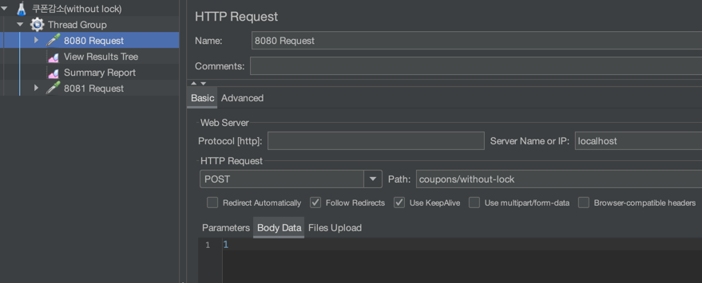
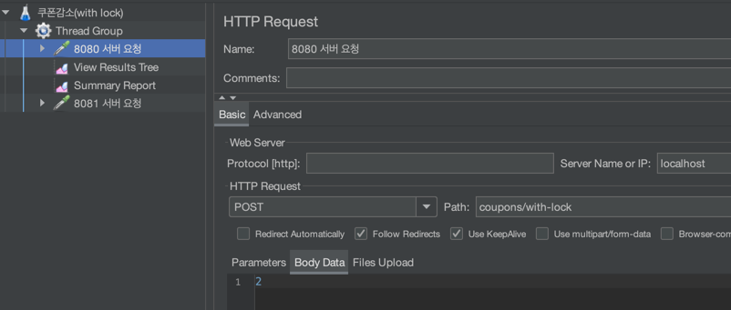
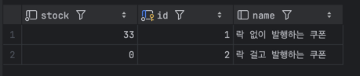

# 분산락 핸즈온

본 프로젝트는 **Redis의 분산 락(Redisson)** 과 MySQL을 함께 사용하여, 쿠폰 발급 혹은 재고 처리 시 발생할 수 있는 동시성 문제를 직접 체험하고 해결하기 위해 만들어졌습니다.

### 1. 프로젝트를 하게 된 이유

- 동시성 이슈 학습: 실제로 여러 사용자가 동시에 쿠폰을 발급받거나, 재고를 차감할 때, 재고가 제대로 처리가 되지 않는 등의 문제를 흔히 겪습니다. 이러한 문제를 Redis의 분산 락을 통해 어떻게 방지할 수
  있는지 실습하고자 합니다.
- 성능/부하 테스트: JMeter와 같은 툴로 간단한 동시성 테스트를 진행해 봄으로써, 락 적용 전과 락 적용 후의 결과 차이를 비교할 수 있습니다.
- 애플리케이션 서버를 2대를 띄운 후(분산환경 재현) 8080서버로 1초동안 500명의 유저, 8081서버로 1초동안 500명의 유저가 쿠폰을 발급받는 상황을 재현합니다.

### 2. 셋업 방법

#### 1. 사전준비

- Docker, Docker Compose
    - 도커 환경이 설치되어 있어야 합니다.
- Java 8 이상, Gradle (또는 Maven)
    - 스프링 부트 애플리케이션을 빌드/실행하기 위함.

#### 2. Docker Compose 실행

```shell
cd ./docker
docker-compose up -d
```

비밀번호, 볼륨 등은 docker-compose.yml 내 설정을 확인해주세요.

#### 3. 애플리케이션 서버 2대 기동
```shell
# 터미널 1
./gradlew bootRun --args="--server.port=8080"
# 터미널 2
./gradlew bootRun --args="--server.port=8081"
```

#### 4. Jmeter 를 통해 8080, 8081 서버 테스트
API: localhost:8080/coupons/without-lock


API: localhost:8080/coupons/with-lock



### Jmeter 결과

- 500명의 유저가 한번에 
  - 락 없이 발행하는 경우 경쟁 조건으로 인한 정합성 불일치
  - 락과 함께 발행하는 경우 정상적으로 0장의 잔여재고


