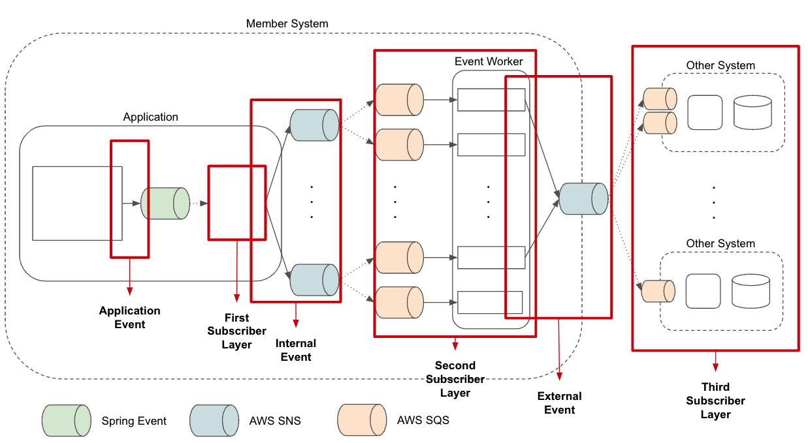

# 회원시스템 이벤트기반 아키텍처 구축하기

## 이벤트로 발행되어야 할 내용

- HTTP 방식, 비동기 방식을 사용한다고 해서 디커플링 되는 것이 아님
- 도메인 이벤트로 달성하려는 목적이 아닌 도메인 이벤트 그 자체를 이벤트로 발행해야 비로소 느슨한 결합이 완성

## 회원 시스템 이벤트 구조

1. 애플리케이션 이벤트 & 첫번째 구독자 계층
    1. Spring Framework의 Application Event 활용
    2. 트랜잭션 제어 가능
    3. 주요 역할: 내부 이벤트를 메시징 시스템(AWS SNS)으로 발행
2. 내부 이벤트 & 두번째 구독자 계층
    1. 도메인 내 비관심사 처리
    2. AWS SNS-SQS로 하나의 이벤트를 여러 구독으로 분산 처리
    3. 외부 이벤트 발행도 담당
3. 외부 이벤트 & 세번째 구독자 계층
    1. 외부 시스템과의 결합을 느슨하게 유지
    2. 이벤트 일반화: “언제, 어떤 회원이(식별자) 무엇을 하여(행위) 어떤 변화(변화 속성)가 발생했는가”
    3. ZERO-PAYLOAD 방식 사용하여 필요 시 API로 상세 정보 획득

## 이벤트 저장소 구축

### 해결한 문제

1. **이벤트 발행 보장 유실**: 어플리케이션-SNS 구간의 HTTP 통신 실패 대응
2. **이벤트 재발행**: 구독자가 이벤트를 처리 실패했을 때 재발행 필요

### 구현 방식

- 이벤트 저장소로 도메인 저장소와 동일한 RDBMS 사용 (Transactional Outbox Pattern)
- 이벤트 저장을 트랜잭션 범위 내에서 처리하여 데이터 일관성 보장
- 이벤트 발행 여부를 저장소에 기록, 미발행 이벤트는 배치 프로그램으로 자동 재발행
- 다양한 조건(기간, 행위, 속성, 회원, 특정 이벤트)으로 이벤트 재발행 지원
- 추가 이점: 회원 활동 이력 추적 기능 통합

### 이벤트 저장소 데이터 구조

- 이벤트 ID, 발행 여부, 발행 시간, 생성 시간
- 회원 번호, 이벤트 타입, 속성 (JSON)
- 수행 사유, 이벤트 채널, 요청자 정보

## 성과

1. **느슨한 결합 달성**: 회원 시스템과 타 시스템 간 의존성 최소화
2. **도메인 응집도 향상**: 핵심 비즈니스 로직과 부가 기능 분리
3. **안정적인 이벤트 처리**: 이벤트 발행 보장 및 재발행 메커니즘 구축
4. **회원 활동 추적 통합**: 다양한 기록 테이블을 하나의 이벤트 저장소로 통합

출처: [회원시스템 이벤트기반 아키텍처 구축하기](https://www.youtube.com/watch?v=b65zIH7sDug&t=824s)