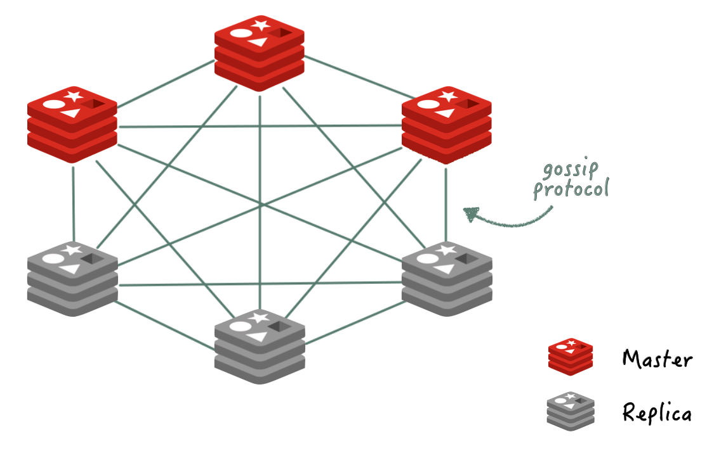

## 레디스 일반 정보

- 인메모리 기반의 저장소이다
- 싱글 스레드로 동작해 레이스 컨디션이 발생하지 않는다

## 레디스 자료구조

- **String**
    - `key: value(string)` 형태이다
    - 모든 문자열을 저장하며, JPEG, HTML 등을 캐싱할 수 있다
- **List**
    - `key: list(val1 - val2 - val3 ...)` 형태이다
    - Linked List 구조를 사용한다
    - Pub/Sub 패턴을 구현할 수 있다
    - `RPUSHX`: 키가 이미 존재할 때만 데이터를 추가한다
    - `BRPOP`: 리스트에 데이터가 추가될 때까지 대기하며, 불필요한 폴링을 줄인다
- **Hash**
    - `key: hash(field1:value, field2:value, ...)` 형태이다
    - 필드 개수에 제한이 없다
- **Set**
    - 일반 Set과 동일하며, 중복 없이 저장되고 순서가 보장되지 않는다
- **Sorted Set**
    - Set과 유사한 특성을 가지며, `score` 필드로 정렬된다
- **Bit/Bitmap**
    - 비트 연산이 가능한 자료구조이다
- **HyperLogLog**
    - 원소 개수 추정에 특화된 자료구조이다
- **Geospatial Index**
    - 위도와 경도를 저장하며, 두 지점 간 거리를 계산한다
    - 내부적으로 Sorted Set을 활용한다
- **Stream**
    - 로그 처리에 최적화된 자료구조이다

## 레디스 키

- 키는 문자열 형태이다
- 빈 문자열도 유효한 키로 사용된다
- `object_type:id` 형태가 권장된다
- 최대 크기는 512MB이다

## 레디스 만료 시간

- 전략에 따라 Redis가 자동으로 키를 삭제한다
- 사용자가 `EXPIRE` 명령으로 만료 시간을 설정할 수 있다

## 레디스 캐시 전략

- **Look Aside**
    - **특징**
        - 캐시를 먼저 조회한다
        - 캐시 히트 시 즉시 반환한다
        - 캐시 미스 시 DB를 조회한 후 캐시에 저장한다
    - **장점**
        - 자주 사용되는 데이터만 캐싱한다
        - Redis 장애가 애플리케이션에 치명적이지 않다
    - **단점**
        - 캐시 데이터가 항상 최신이 아닐 수 있다
        - 캐시 미스 시 응답 속도가 느려진다
- **Write Through**
    - **특징**
        - DB 쓰기 시 Redis에 데이터를 동기적으로 저장하거나 갱신한다
    - **장점**
        - 캐시 데이터가 항상 최신이다
    - **단점**
        - 데이터 업데이트가 DB와 Redis 두 단계로 이루어져 느리다

## 레디스 활용 사례

- **좋아요**
    - Set을 활용하며, 예: `post:1177 - set{1, 7, 19, 12}` (좋아요한 유저 ID를 저장)
- **일 방문자 수**
    - Bitmap을 사용하며, 천만 명의 유저를 약 1.2MB로 표현한다 (Redis String 최대 크기는 512MB)
    - `daily:20250103`, `daily:20250104` 등의 키에 대해 `BITOP AND` 연산으로 매일 접속한 유저를 빠르게 계산한다
    - 

- **최근 검색 기록**
    - Sorted Set을 활용하며, 예: `user:11137 - {value:검색어, score:검색일자}`
    - 검색일자(`score`) 기준으로 오름차순 정렬된다
    - 최대 5개 유지 시, 업데이트 후 `-6` 인덱스를 삭제해 갯수를 제한한다
    - 

## HA(High Availability) 레디스 고가용성 지원

- **Replication**
    - 싱글 마스터와 멀티 슬레이브 구조이다
    - 마스터 데이터는 비동기로 슬레이브에 전송된다
    - **마스터-슬레이브 연동 방식**
        - 초기 연동은 Full Sync로 진행된다
        - 네트워크 장애 후 재연동 시, 오프셋을 활용한 증분 동기화가 이루어진다 (오프셋 불일치 시 Full Sync)
        - 동기화 후에는 실시간 데이터 전송이 된다
    - 마스터 다운 시 슬레이브 승격과 애플리케이션 호스트 설정은 수동으로 처리된다
- **Sentinel**
    - 
    - 여러 센티넬이 마스터와 슬레이브를 모니터링한다
    - 싱글 마스터와 멀티 슬레이브 구조이다
    - 마스터 다운 시 센티넬이 페일오버를 실행한다
    - 센티넬은 투표로 슬레이브를 마스터로 승격한다
        - 투표는 네트워크 장애로 일부 센티넬이 오판하는 것을 방지하며, 다중 마스터 발생 시 Split Brain 상황이 된다
    - 최소 3개의 센티넬이 필요하다
    - 다운된 노드가 복구되면 슬레이브로 추가된다
    - 애플리케이션은 여러 센티넬 노드를 등록해야 한다
- **Cluster**
    - 
    - 가십 프로토콜을 사용한다
    - 모든 마스터와 슬레이브가 서로 연결된다
    - 총 16,384개의 해시 슬롯을 가지며, 마스터 노드가 슬롯을 분담한다
    - 키는 `HASH_SLOT = CRC16(key) mod 16384` 알고리즘으로 슬롯에 매핑된다
    - 마스터 노드 추가 시 슬롯은 수동 또는 자동으로 재배치된다
    - 애플리케이션 라이브러리는 클러스터 설정 시 해시 슬롯 정보를 가져와 키를 해당 슬롯으로 전송한다
    - 잘못된 슬롯으로 전송 시, 클러스터가 `MOVED` 응답으로 올바른 슬롯을 알려준다

## 레디스 위험한 커맨드

- 싱글 스레드 특성상 오래 걸리는 커맨드는 다른 작업을 지연시켜 장애를 유발한다
- `KEYS *`: 모든 키를 출력하며, 대량 데이터 처리 시 성능 저하가 발생한다
- `FLUSHALL / FLUSHDB`: 메모리 내 모든 데이터를 삭제한다
- `SAVE`: 메모리 내용을 파일로 저장하며, 다른 클라이언트 요청을 차단한다
- `MONITOR`: 모든 클라이언트의 커맨드를 실시간 출력하며, 리소스를 과도하게 소모한다

> 출처: https://meetup.nhncloud.com/posts/224 