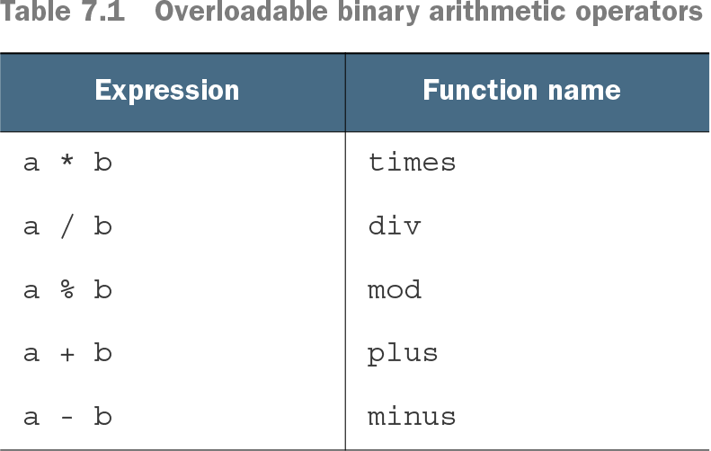
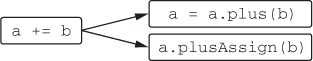
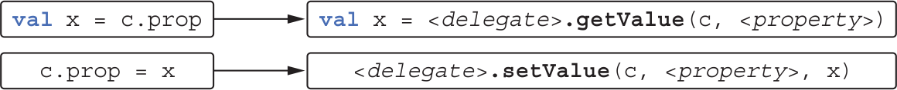

# 7장 연산자 오버로딩과 기타 관례

- 클래스 안에 plus 라는 이름의 특별한 메서드를 정의하면 그 클래스 인스턴스에 대해 + 연산자 사용 가능
- 이런식으로 어떤 언어 기능과 미리 정해진 이름의 함수를 연결해주는 기법을 코틀린에서는 **관례**라고 함
- 기존 자바 클래스에 대해 확장 함수를 구현하면서 관례에 따라 이름을 붙이면 기존 자바 코드를 바꾸지 않아도 새로운 기능 부여 가능

## 7.1 산술 연산자 오버로딩
### 7.1.1 이항 산술 연산 오버로딩
- 두 점을 더하는 연산
```kotlin
data class Point(val x: Int, val y: Int) {
    operator fun plus(other: Point): Point {                      
        return Point(x + other.x, y + other.y)                    
    }
}
>>> val p1 = Point(10, 20)
>>> val p2 = Point(30, 40)
>>> println(p1 + p2)                                             
Point(x=40, y=60)
```
- plus 함수 앞에 operator 키워드를 추가해야 함
  - 연산자 오버로딩 함수 앞에는 operator 키워드 필수  
- plus 함수 선언 후 + 기호로 두 Point 객체를 더하는 것이 가능
- 연산자를 멤버 함수로 만드는 대신 확장 함수로도 정의 가능
```kotlin
data class Point(val x: Int, val y: Int)

operator fun Point.plus(other: Point): Point {
    return Point(x + other.x, y + other.y)
}

fun main(args: Array<String>) {
    val p1 = Point(10, 20)
    val p2 = Point(30, 40)
    println(p1 + p2)
}
```
**오버로딩 가능한 이항 산술 연산자**


- 두 피연산자가 같은 타입일 필요는 없음
- 코틀린 연산자가 자동으로 교환 법칙을 지원하지 않음
  - p * 1.5 라는 연산 외에도 1.5 * p 로도 써야 한다면 `operator fun Double.times(p: Point)..` 작성 필요
- 결과 타입이 피연산자 타입과 다른 연산자도 정의 가능
  - `operator fun Char.times(count: Int): String ..`
- operator 함수도 오버로딩할 수 있음, 이름은 같지만 파라미터 타입이 서로 다른 연산자 함수를 다양하게 생성 가능

### 7.1.2 복합 대입 연산자 오버로딩
- 연산자를 오버로딩하면 그와 관련된 복합 대입 연산자도 함께 지원
- 변수가 변경 가능한 경우에만 복합 대입 연산자 사용 가능
  - += 연산은 참조를 다른 참조로 바꿈
- 바꿔치기가 아닌 상태를 바꾸고 싶다면 반환 타입이 Unit 인 plusAssign 함수를 정의
- 코틀린은 mutable 컬렉션에 대해 plusAssign을 정의함
- plus와 plusAssign 연산을 동시에 정의하지 말 것
  - 
  - += 연산자는 plus 또는 plusAssign 함수 호출로 번역할 수 있음
- 코틀린은 컬렉션에 대해 두 가지 접근 방법을 함께 제공
  - +와 -는 항상 새로운 컬렉션을 반환
  - += 와 -= 연산자는 항상 변경 가능한 컬렉션에 작용하여 메모리에 있는 객체 상태를 변화
  - 읽기 전용 컬렉션에서 +=와 -=는 변경을 적용한 복사본을 반환
    - var 선언한 변수가 가리키는 읽기 전용 컬렉션에서만 +=와 -=적용 가능

### 7.1.3 단항 연산자 오버로딩
```kotlin
operator fun Point.unaryMinus(): Point {           
    return Point(-x, -y)                           
}
>>> val p = Point(10, 20)
>>> println(-p)
Point(x=-10, y=-20)
```
- 단항 함수는 파라미터가 없음
- 증가/감소 연산자를 오버로딩하면 전위, 후위 연산 자동 지원
```kotlin
operator fun BigDecimal.inc() = this + BigDecimal.ONE
>>> var bd = BigDecimal.ZERO
>>> println(bd++)                                  
0
>>> println(++bd)                                  
2
```

## 7.2 비교 연산자 오버로딩

### 7.2.1 동등성 연산자: equals
- 코틀린은 ==연산자 호출을 equals 메서드 호출로 컴파일
- != 연산자를 사용하는 식도 equals 호출로 컴파일
- ==와 !=는 내부에서 인자가 널인지 검사
  - nullable 값에도 적용 가능
- 식별자 비교 연산자(===)을 사용해 equals의 파라미터가 수신 객체와 같은지 확인
  - 식별자 비교 연산자는 자바의 == 연산자와 동일
  - ===를 오버로딩할 수 없다
- Any의 equals에는 operator가 붙어 있지만 그 메서드를 오버라이드하는 메서드 앞에는 opeator 변경자를 붙이지 않다고 자동으로 상위 클래스의 operator 가 적용
- Any에서 상속받은 equals가 확장 함수보다 우선순위가 높기 때문에 equals를 확장 함수로 정의할 수 없음

### 7.2.2 순서 연산자: compareTo
- 자바에서는 `<` 또는 `>` 연산자로는 원시 타입의 값만 비교 가능
  - 다른 모든 타입의 값에는 `element1.compareTo(element2)`를 명시적으로 사용함
- 코틀린도 Comparable 인터페이스를 지원하고, compareTo 메서드를 호출하는 관례를 제공
  - 따라서 비교 연산자 호출시 compareTo 호출로 컴파일
- Comparable 인터페이스를 코틀린뿐 아니라 자바 쪽의 컬렉션 정렬 메서드 등에도 사용 가능
- equals와 마찬가지로 Comparable의 compareTo에도 operator 변경자가 붙어있어 하위클래스의 오버라이딩 함수에 operator를 붙이지 않아도 됨
- Compareable 인터페이스를 구현하는 모든 자바 클래스를 코틀린에서 간결한 연산자 구문으로 비교 가능
  - `println("abc" < "bac")`

## 7.3 컬렉션과 범위에 대해 쓸 수 있는 관례

### 7.3.1 인덱스로 원소에 접근: get과 set
- 각괄호를 통해 인덱스에 접근 가능한데 이것은 관례를 통해 가능 (인덱스 연산자)
- 인덱스 연산자를 사용해 원소를 읽을 땐 get 연산자로 컴파일
- 인덱스 연산자를 사용해 원소를 쓸 땐 set 연산자로 컴파일

get 관례 구현
```kotlin
operator fun Point.get(index: Int): Int {                 
    return when(index) {
        0 -> x                                            
        1 -> y                                            
        else ->
            throw IndexOutOfBoundsException("Invalid coordinate $index")
    }
}
>>> val p = Point(10, 20)
>>> println(p[1])
20
```
set 관례 구현
```kotlin
data class MutablePoint(var x: Int, var y: Int)
operator fun MutablePoint.set(index: Int, value: Int) {           
    when(index) {
        0 -> x = value                                            
        1 -> y = value                                            
        else ->
            throw IndexOutOfBoundsException("Invalid coordinate $index")
    }
}
>>> val p = MutablePoint(10, 20)
>>> p[1] = 42
>>> println(p)
MutablePoint(x=10, y=42)
```

### 7.3.2 in 관례
- `in`은 객체가 컬렉션에 들어있는지 검사 (멤버십 검사)
  - 이 경우 대응하는 함수는 contains()

### 7.3.3 rangeTo 관례
- `..`연산자는 rangeTo 함수를 간략하게 표현하는 방법
- `start..end` -> `start.rangeTo(end)` .. 연산자는 rangeTo 함수 호출로 컴파일
- Comparable 인터페이스를 구현하는 클래스라면 rangeTo를 정의 불필요. 이미 모든 Comparable 객체에 대해 적용가능한 rangeTo함수가 존재
- rangeTo 연산자는 다른 산술 연산자보다 우선순위가 낮음
  - 혼동을 피하기 위해 괄호로 인자를 감싸기 `println(0..(n + 1))`

### 7.3.4 for 루프를 위한 iterator 관례
- for 루프는 범위 검사와 동일한 in 연산자 사용
- 이 경우에는 list.iterator()를 호출하여 이터레이터를 얻고, hasNext와 next 호출을 반복하는 식으로 변환

## 7.4 구조 분해 선언과 component 함수
- 내부적으로 구조 분해 선언은 관례를 사용
  - 각 변수를 초기화 하기 위해 component**N**이라는 함수를 호출
  - 
- data class의 주 생성자에 들어있는 프로퍼티에 대해서는 컴파일러가 자동으로 componentN 함수 생성
- 반환되는 data class 프로퍼티를 구조분해 형태로 초기화 가능
```kotlin
data class NameComponents(val name: String,                     
                          val extension: String)
fun splitFilename(fullName: String): NameComponents {
    val result = fullName.split('.', limit = 2)
    return NameComponents(result[0], result[1])                 
}
>>> val (name, ext) = splitFilename("example.kt")               
>>> println(name)
example
>>> println(ext)
kt
```
- 컬렉션에 대해서도 구조 분해 선언 가능(단, 맨 앞 다섯 원소에 대해서)
```kotlin
data class NameComponents(
        val name: String,
        val extension: String)

fun splitFilename(fullName: String): NameComponents {
    val (name, extension) = fullName.split('.', limit = 2)
    return NameComponents(name, extension)
}
```
- Pair나 Triple 클래스를 사용하여 클래스를 따로 data class 만들지 않고 반환 가능
  - 하지만 경우에 따라 가독성이 떨어질 수 있음

### 7.4.1 구조 분해 선언과 루프
- 변수 선언이 들어갈 수 있는 장소라면 어디든 구조 분해 선언 사용 가능
```kotlin
fun printEntries(map: Map<String, String>) {
    for ((key, value) in map) {                             
        println("$key -> $value")
    }
}
>>> val map = mapOf("Oracle" to "Java", "JetBrains" to "Kotlin")
>>> printEntries(map)
Oracle -> Java
JetBrains -> Kotlin
```
- 위 예제는 `객체를 이터레이션하는 관례`, `구조 분해 선언` 총 두 가지 코틀린 관례를 활용

## 7.5 프로퍼티 접근자 로직 재활용: 위임 프로퍼티
**위임 프로퍼티**
- 백킹필드에 단순히 값을 저장하는 것보다 더 복잡한 방식으로 작동하는 프로퍼티를 쉽게 구현 가능
- 위임을 사용해 자신의 값을 필드가 아니라 데이터베이스 테이블이나 브라우저 세션, 맵 등에 저장 가능

**위임이란**
- 객체가 직접 작업을 수행하지 않고 다른 도우미 객체가 그 작업을 처리하게 맡기는 디자인 패턴
- 도우미 객체를 위임 객체(delegate) 라고부름

### 7.5.1 위임 프로퍼티 소개

```kotlin
import java.lang.reflect.Type

class Foo {
  var p: Type by Delegate() // by 키워드는 프로퍼티와 위임 객체를 연결
}

// 컴파일러가 실행한 결과
class Foo {
  private val delegate = Delegate() // 숨겨진 프로퍼티
  var p: Type
    set(value: Type) = delegate.setValue(,,,. value)
    get() = delegate.getValue(...)
}

// Delegate 클래스는 get, set 관례를 제공해야 함
class Delegate {
  operator fun getValue(...) {...}
  operator fun setValue(..., value: Type) {...}
}
```
- foo.p는 일반 프로퍼티처럼 쓸 수 있고, 일반 프로퍼티 처럼 보임
  - 실제로는 p의 게터나 세터는 Delegate 타입의 위임 프로퍼티 객체에 있는 메서드 호출

### 7.5.2 위임 프로퍼티 사용: by lazy()를 사용한 프로퍼티 초기화 지연
백킹 프로퍼티를 사용해 지연초기화 구현
```kotlin
class Email { /*...*/ }
fun loadEmails(person: Person): List<Email> {
  println("Load emails for ${person.name}")
  return listOf(/*...*/)
}
class Person(val name: String) {
    private var _emails: List<Email>? = null            
    val emails: List<Email>
       get() {
           if (_emails == null) {
               _emails = loadEmails(this)               
           }
           return _emails!!                             
       }
}
>>> val p = Person("Alice")
>>> p.emails                                            
Load emails for Alice
>>> p.emails
```
- 백킹 프로퍼티를 사용
- 프로퍼티를 두 개 사용해야 하고 추가적인 코드 구현이 성가심
```kotlin
class Person(val name: String) {
    val emails by lazy { loadEmails(this) }
}
```
- **위임 프로퍼티**는 데이터를 저장할 때 쓰이는 백킹 프로퍼티와 값이 오직 한번만 초기화됨을 보장하는 게터 로직을 함께 캡슐화
- 위임 객체를 반환하는 표준 라이브러리 함수가 **lazy**
- lazy 함수는 코틀린 관례에 맞는 시그니처의 getValue 메서드가 들어있는 객체를 반환
- lazy를 by 키워드와 함께 사용해 위임 프로퍼티 생성 가능
- lazy 함수는 기본적으로 스레드 세이프
  - 필요에 따라 동기화에 사용할 락을 lazy 함수에 전달 가능
  - 다중 스레드 환경에서 사용하지 않을 프로퍼티를 위해 lazy 함수가 동기화를 하지 못하게 방지 가능

### 7.5.3 위임 프로퍼티 구현
- 어떤 객체의 프로퍼티가 바뀔 대마다 리스너에게 변경 통지를 보내는 예제
- 자바 빈 패키지의 PropertyChangeSupport 클래스를 활용

```kotlin
// PropertyChangeSupport를 사용하기 위한 도우미 클래스
open class PropertyChangeAware {
    protected val changeSupport = PropertyChangeSupport(this)

    fun addPropertyChangeListener(listener: PropertyChangeListener) {
        changeSupport.addPropertyChangeListener(listener)
    }

    fun removePropertyChangeListener(listener: PropertyChangeListener) {
        changeSupport.removePropertyChangeListener(listener)
    }
}

class Person(val name: String, age: Int, salary: Int): PropertyChangeAware() {
    var age: Int = age
        set(newValue) {
            val oldValue = field
            field = newValue
            changeSupport.firePropertyChange("age", oldValue, newValue)
        }
    var salary: Int = salary
        set(newValue) {
            val oldValue = field
            field = newValue
            changeSupport.firePropertyChange("salary", oldValue, newValue)
        }
}

@Test
fun test1() {
  val p = Person("Dimitry", 34, 2000)
  p.addPropertyChangeListener(
    PropertyChangeListener { event ->
      println("Property ${event.propertyName} changed from ${event.oldValue} to ${event.newValue}")
    }
  )
  p.age = 35
  p.salary = 3000
  //>> Property age changed from 34 to 35
  //>> Property salary changed from 2000 to 3000
}
```
- 세터코드의 중복이 많음

```kotlin
// 프로퍼티의 값을 저장후 필요에 따라 통지를 보내주는 클래스
class ObservableProperty(val propName: String, var propValue: Int, val changeSupport: PropertyChangeSupport) {
    fun getValue(): Int = propValue
    fun setValue(newValue: Int) {
        val oldValue = propValue
        propValue = newValue
        changeSupport.firePropertyChange(propName, oldValue, newValue)
    }
}

class Person(val name: String, age: Int, salary: Int) : PropertyChangeAware() {
    val _age = ObservableProperty("age", age, changeSupport)
    var age: Int
        get() = _age.getValue()
        set(value) {
            _age.setValue(value)
        }

    val _salary = ObservableProperty("salary", salary, changeSupport)
    var salary: Int
        get() = _salary.getValue()
        set(value) {
            _salary.setValue(value)
        }
}
```
- 각각의 프로퍼티마다 ObservableProperty 를 생성해야 함

```kotlin
// 프로퍼티 위임에 사용할 수 있게 바꾼 ObservableProperty
class ObservableProperty(var propValue: Int, val changeSupport: PropertyChangeSupport) {
  operator fun getValue(p: Person, prop: KProperty<*>): Int = propValue
  operator fun setValue(p: Person, prop: KProperty<*>, newValue: Int) {
    val oldValue = propValue
    propValue = newValue
    changeSupport.firePropertyChange(prop.name, oldValue, newValue)
  }
}

class Person(val name: String, age: Int, salary: Int) : PropertyChangeAware() {
  var age: Int by ObservableProperty(age, changeSupport)
  var salary: Int by ObservableProperty(salary, changeSupport)
}
```

### 7.5.4 위임 프로퍼티 컴파일 규칙
```kotlin
class C {
    var prop: Type by MyDelegate()
}
val c = C()
```
- 컴파일러는 MyDelegate의 인스턴스를 감춰진 프로퍼티에 저장하고 <delegate>로 명명
- 컴파일러는 프로퍼티를 표현하기 위해 KProperty 타입의 객체를 사용
  - 이 객체를 <property> 라고 명명
```kotlin
class C { 
    private val <delegate> = MyDelegate()
    var props: Type
    get() = <delegate>.getValue(this, <property>)
    set(value: Type) = <delegate>.setValue(this, <property>, value)        
}
```
- 컴파일러는 모든 프로퍼티 접근자 안에 getValue와 setValue 호출 코드를 생성함

- 프로퍼티 저장 공간을 변경할 수 있고 프로퍼티를 읽거나 쓸때 검증, 변경통지 등이 가능

### 7.5.5 프로퍼티 값을 맵에 저장
- **확장 가능한 객체(expando object)**: 자신의 프로퍼티를 동적으로 정의할 수 있는 객체를 만들 때 위임 프로퍼티를 활용하는 경우 사용하는 객체
  - ex) 연락처 관리 시스템에서 연락처별 임의의 정보 저장을 허용하는 경우
    - 특별히 처리해야 하는 필수 정보: 이름
    - 사람마다 달라지는 정보
  - 위 경우 정보를 모두 맵에 저장하되, 맵을 통해 처리하는 프로퍼티를 통해 필수 정보를 제공하는 방법 존재

**값을 맵에 저장하는 프로퍼티**
```kotlin
class Person {
    private val _attributes = hashMapOf<String, String>()
    fun setAttribute(attrName: String, value: String) {
        _attributes[attrName] = value
    }
    val name: String
        get() = _attributes["name"]!! // 수동으로 맵에서 정보를 추출
}
>>> val p = Person()
>>> val data = mapOf("name" to "Dmitry", "company" to "JetBrains")
>>> for ((attrName, value) in data)
...    p.setAttribute(attrName, value)
>>> println(p.name)
Dmitry
```

**값을 맵에 저장하는 위임 프로퍼티 사용**
```kotlin
class Person {
    private val _attributes = hashMapOf<String, String>()
    fun setAttribute(attrName: String, value: String) {
      _attributes[attrName] = value
    }
    val name: String by _attributes
    
    val company: String by _attributes
    
    val city: String by _attributes
}
```
- p.name 호출 시 _attributes.getValue(p, prop) 호출
- _attributes.getValue(p, prop) 호출은 _attributes[prop.name]을 통해 구현
- 위 코드에서 attribute로 city라는 키와 값을 넣지 않으면 p.city 호출시 `java.util.NoSuchElementException: Key city is missing in the map.` 발생


### 7.5.6 프레임워크에서 위임 프로퍼티 활용
위임 프로퍼티를 사용해 데이터베이스 컬럼 접근하기
```kotlin
object Users : IdTable() { // 객체는 데이터베이스 테이블에 해당
    val name = varchar("name", length = 50).index() // 프로퍼티는 컬럼에 해당
    val age = integer("age")
}
class User(id: EntityID) : Entity(id) { // 각 유저 인스턴스는 테이블에 들어있는 구체적인 엔티티에 해당
    var name: String by Users.name // 사용자 이름은 데이터베이스 "name" 컬럼에 존재
    var age: Int by Users.age
}
```