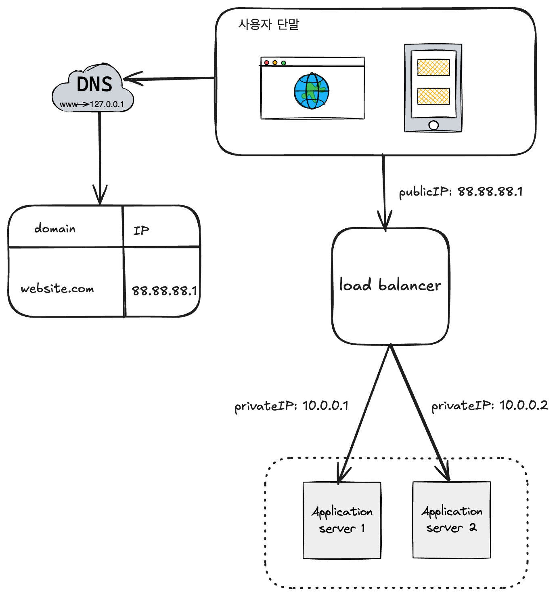
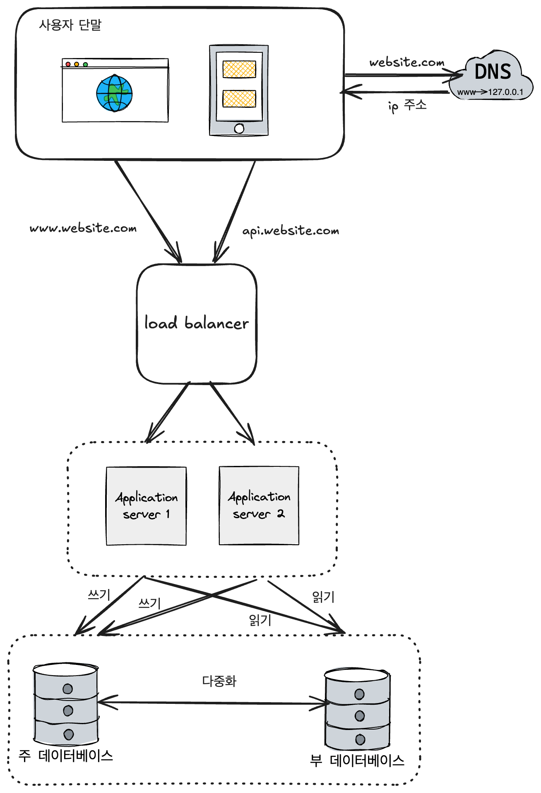
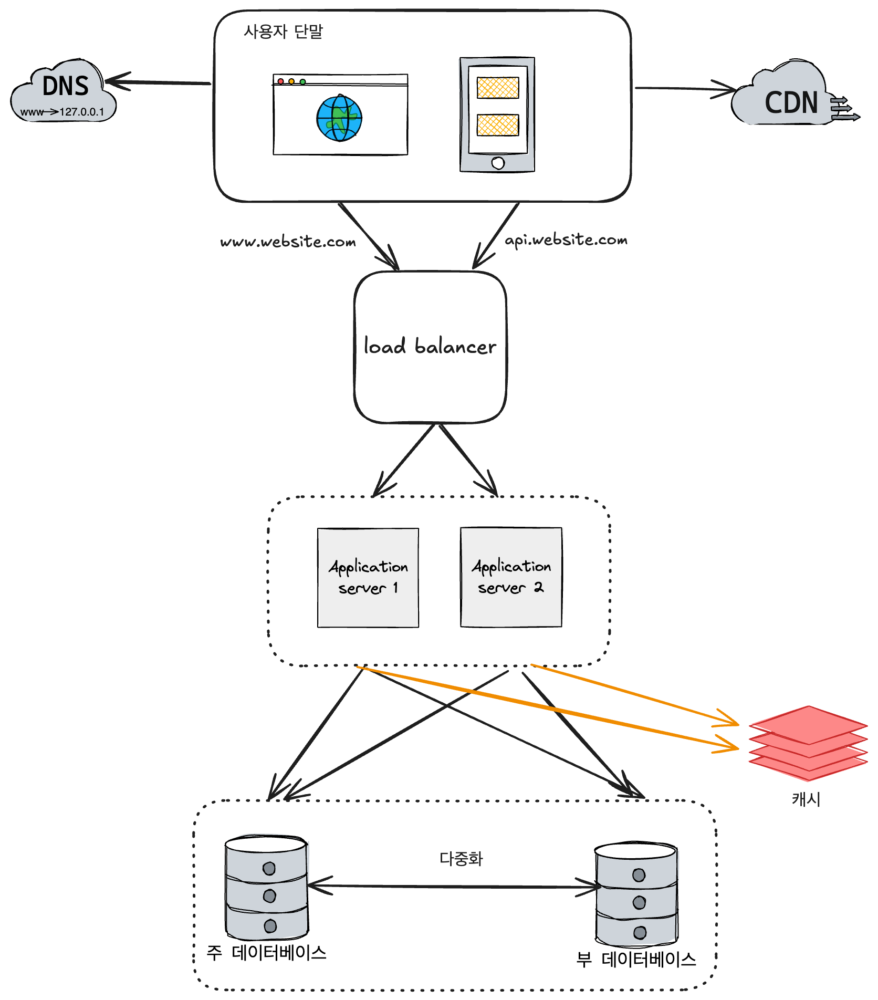
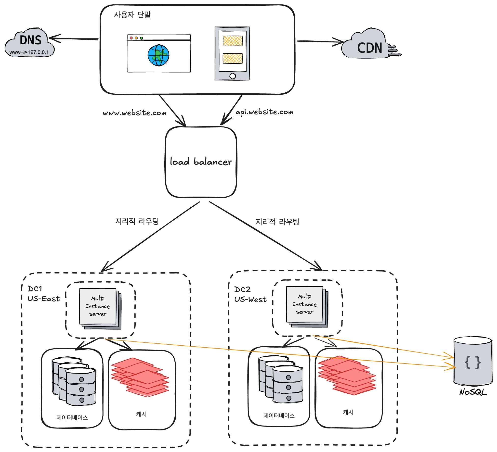
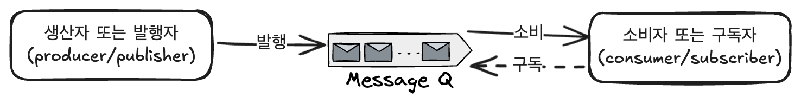
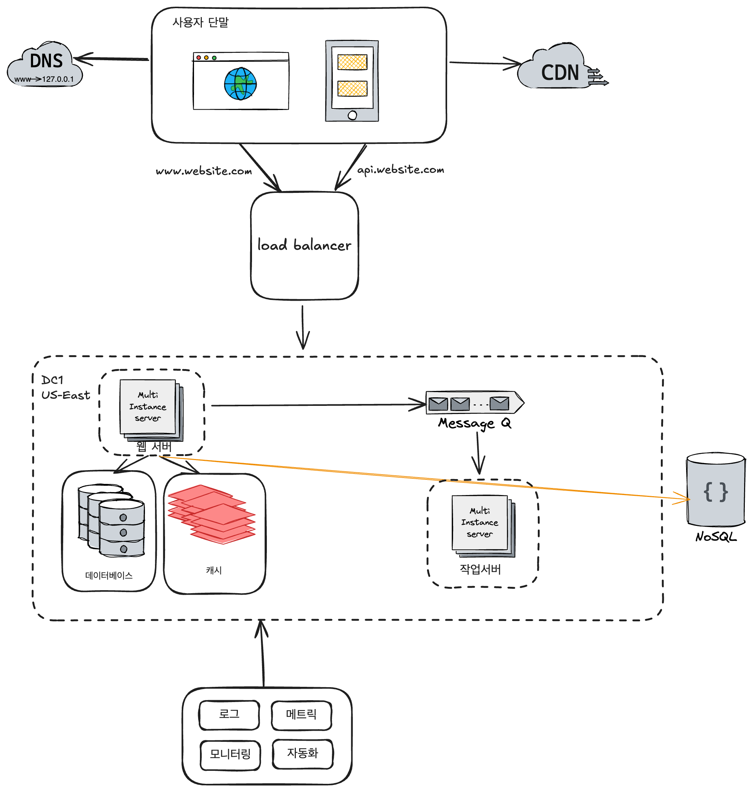
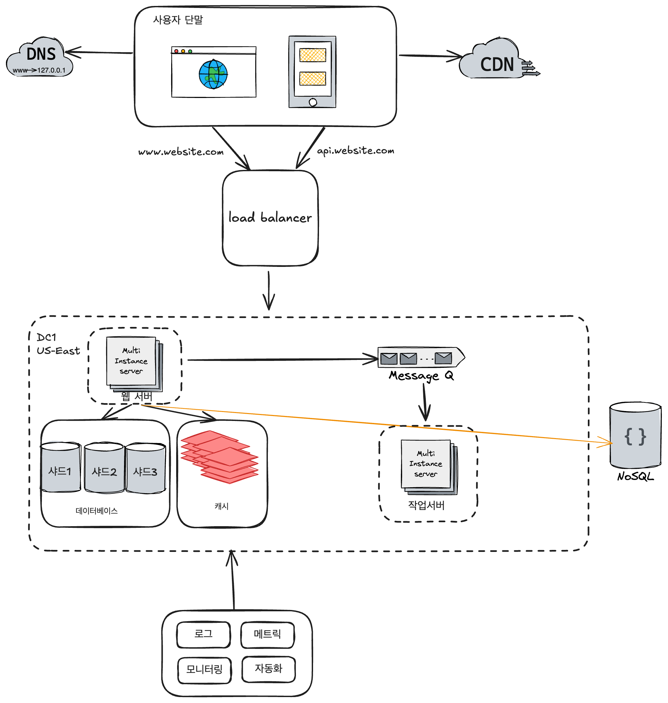

# 1장 사용자 수에 따른 규모 확장성

## 단일서버

### 사용자 요청 처리 흐름

1. 사용자는 도메인 이름을 도메인 이름 서비스(Domain Name Service, DNS)에 질의 후 IP 주소로 변환
2. DNS 조회 결과로 IP 주소 반환
3. 해당 IP 주소로 HTTP(HyperText Transfer Protocol) 요청 전달
4. 요청을 받은 웹 서버는 HTML 페이지나 JSON 형태의 응답 반환

## 데이터 베이스

### 어떤 데이터베이스를 사용할 것인가?

관계형 데이터베이스(RDBMS)

- MySql, Oracle, Postgresql,..

비-관계형 데이터베이스(NoSQL)

- CouchDB, Neo4j, Cassandra, HBase, Amazon DynamoDB,..

NoSQL의 부류 네 가지

- 키-값 저장소(key-value store)
- 그래프 저장소(graph store)
- 칼럼 저장소(column store)
- 문서 저장소(document store)

NoSQL은 일반적으로 조인연산을 지원하지 않는다.

아래와 같은 경우 비-관계형 데이터베이스가 바람직할 수 있다.

- 아주 낮은 응답 지연시간(latency)이 요구되는 경우
- 다루는 데이터가 비정형(unstructured)이라 관계형 데이터가 아닌 경우
- 데이터를 직렬화(serialize)하거나 역직렬화(desrialize) 할 수 있기만 하면 되는 경우
- 아주 많은 양의 데이터를 저장할 필요가 있는 경우

## 수직적 규모 확장(scale up) vs 수평적 규모 확장(scale out)

스케일 업이란? 서버에 고사양 자원(고성능 CPU, 많은 RAM)을 추가하는 행위

스케일 아웃이란? 더 많은 서버를 추가하여 성능을 개선하는 행위

수직적 규모 확장의 단점 2가지

- 한 대의 서버에 CPU나 메모리 무한 증설 불가
- 장애에 대한 자동복구 방안이나 다중화 불가

서버가 한계 상황에 도달할 때 **로드밸런서**를 도입하는 것이 최선이다.

### 로드밸런서

그림 설명

1. 사용자는 로드밸런서의 공개 IP 주소로 접속
2. 보안을 위해 서버 간 통신에는 사설 IP 주소를 이용, 로드밸런서는 웹 서버와 통신하기 위해 사설 주소를 이용.

웹 계층의 가용성이 향상되는 이유 2가지

- 서버 1이 다운되면 모든 트래픽이 서버2로 전송되므로 웹 사이트 전체가 다운되는 일 방지
- 트래픽이 가파르게 증가할 시 웹 서버 계층에 더 많은 서버를 추가하면 자동 트래픽 분산

### 데이터베이스 다중화

데이터베이스 다중화란? 서버 사이에 주(master)-부(slave) 관계를 설정하고 데이터 원본은 주 서버에, 사본은 부 서버에 저장하는 방식

주 데이터베이스: 데이터베이스를 변경하는 명령어를 지원(insert, delete, update,..)

부 데이터베이스: 주 데이터베이스로부터 사본을 전달 받으며 읽기 연산만(read operation)을 지원

데이터베이스 다중화의 장점

- 더 나은 성능: 병렬로 처리될 수 있는 질의의 수 증가
- 안정성: 데이터베이스 서버 일부 파괴시에도 데이터 보존
- 가용성: 하나의 데이터베이스 서버에 장애 발생시에도 서비스 지속 가능

그림 설명

1. DNS로부터 로드밸런서의 공개IP 주소 질의
2. 해당 IP를 사용해 로드밸런서 접속
3. 서버1 또는 서버2에게로 HTTP 요청 전달
4. 부 데이터베이스에게 데이터 조회 연산 전달, 주 데이터베이스에게 데이터변경 연산 전달

앞으로 응답시간(latency)개선가능, **캐시**와 **CDN** 사용가능

## 캐시

캐시란? 데이터를 메모리 안에 두고, 뒤이은 요청이 보다 빨리 처리될 수 있도록 하는 저장소

### 캐시 계층

데이터베이스의 부하를 줄이고, 캐시 계층의 규모를 독립적으로 확장 가능.

캐시 전략 중 하나 **read-through caching strategy** 과정

1. 데이터가 캐시에 존재하면 캐시에서 데이터 조회
2. 데이터가 캐시에 없다면 데이터베이스에서 해당 데이터를 읽어 캐시에 저장
3. 웹 서버에 데이터 반환

### 캐시 사용 시 유의할 점

- 캐시는 어떤 상황에 바람직한가?
    - 데이터 갱신은 자주 일어나지 않지만 참조는 빈번하게 일어나는 경우
- 어떤 데이터를 캐시에 두어야 하는가?
    - 캐시 서버는 휘발성. 캐시 서버가 재시작될 시 캐시데이터가 모두 사라지므로 중요데이터는 지속 저장소에 저장
- 캐시에 보관된 데이터는 어떻게 만료되는가?
    - 만료기한이 너무 짧다면 데이터베이스를 자주 읽고, 너무 길어도 원본가 차이가 나기 때문에 적절한 만료 시간 설정
- 일관성은 어떻게 유지되는가?
    - 저장소의 원본을 갱신하는 연산과 캐시 갱신 연산이 단일 트랜잭션으로 처리되지 않을 경우 일관성이 깨지므로 유의
- 장애에는 어떻게 대처할 것인가?
    - 캐시 서버가 한대라면 단일 장애 지점(SPOF,Single Point of Failure)이 될 수 있으므로 여러 지역에 걸쳐 캐시 서버를 분산
- 캐시 메모리는 얼마나 크게 잡을 것인가?
    - 캐시 메모리가 너무 작다면 액세스 패턴에 따라 캐시에서 데이터가 자주 밀려나므로(eviction) 캐시 메모리를 과할당하는 방법을 사용할 수 있음
- 데이터 방출(eviction) 정책은 무엇인가?
    - 캐시가 모두 찬 경우 기존 데이터를 내보내야 하는데 이 때 자주 쓰이는 정책이 LRU(Least Recently Used - 마지막 사용시점이 가장 오래된 데이터 방출)이다. 이 외에 LFU(Least Frequently Used - 사용 빈도가 가장 낮은 데이터 방출), FIFO(First In First Out - 가장 먼저 캐시에 들어온 데이터 방출) 등을 사용

## 콘텐츠 전송 네트워크(CDN)

CDN이란? 정적 콘텐츠를 전송하는데 쓰이는 지리적으로 분산된 서버의 네트워크. 이미지, 비디오, CSS, JavaScript 파일 등을 캐시.

사용자가 웹사이트를 방문하면, 그 사용자에게 가장 가까운 CDN 서버가 정적 콘텐츠를 전달하는 방식

CDN 동작 원리

1. 사용자 A → 이미지 URL을 이용해 image.png 접근
2. CDN 서버의 캐시에 해당 이미지가 없는 경우, 원본 서버(웹서버, S3 온라인저장소,..)에 요청하여 파일 조회
3. 원본 서버가 CDN서버에 파일 반환. 응답의 HTTP 헤더에 해당 파일의 캐시 만료 시간인 TTL 존재
4. CDN 서버는 파일을 캐시 후 사용자 A에게 반환
5. 사용자 B → 동일한 이미지 요청을 CDN에 전송
6. 만료되지 않은 이미지라면 캐시를 통해 처리

### CDN 사용 시 고려해야 할 사항

- 비용: CDN으로 In,Out 되는 데이터 전송 양에 따라 요금 부과되므로, 자주 사용되지 않는 콘텐츠는 캐싱하지 않도록 유의
- 적절한 만료 시한 설정: 시간에 민감한 데이터라면 적절한 만료 시점 설정
- CDN 장애에 대한 대처 방안: CDN 서버가 죽었을 경우 원본 서버로부터 직접 콘텐츠를 조회하도록 클라이언트 구성
- 콘텐츠 무효화 방법: 아직 만료되지 않은 콘텐츠를 만료시키고 싶은 경우
    - CDN 사업자가 제공하는 API를 이용하여 콘텐츠 무효화
    - 콘텐츠의 다른 버전을 서비스하도록 오브젝트 버저닝 이용

## 무상태(stateless) 웹 계층

### 상태 정보 의존적인 아키텍처

서버가 클라이언트 정보, 즉 상태를 유지하여 요청들 사이에 공유되도록 하는 서버

같은 클라이언트의 요청이 항상 같은 서버로 전송되어야 하는 문제 발생. 로드밸런서가 고정 세션이라는 기능을 제공하지만 로드밸런서에 부하가능성 존재.

### 무상태 아키텍처

사용자로부터의 HTTP 요청은 어떤 웹 서버로도 전달 가능. 상태 정보가 필요할 경우 공유 저장소로부터 데이터 조회.

## 데이터 센터

지리적 라우팅(geoDNS-routing or geo-routing):두 개의 데이터 센터 이용시 장애가 없는 상황에서 사용자는 가장 가까운 데이터 센터로 안내. 

DC2가 장애가 발생해도 모든 트래픽은 DC1으로 전송

다중 데이터센터 아키텍처를 만들 때 해결해야할 점

- 트래픽 우회: GeoDNS는 사용자에게 가장 가까운 데이터센터로 트래픽전송
- 데이터 동기화: 데이터를 여러 데이터 센터에 걸쳐 다중화 하여 장애 후 복구시에도 데이터의 동기화 유지
- 테스트와 배포: 자동화된 배포 도구를 통해 모든 데이터 센터에 동일한 서비스 실시 유지

시스템 컴포넌트를 분리하여 각기 독립적으로 확장할 수 있도록 돕는 **메시지 큐**가 존재

## 메시지 큐

메시지 큐란? 메시지의 무손실을 보장하는 비동기 통신을 지원하는 컴포넌트. 메시지의 버퍼 역할과 동시에 비동기적으로 전송.

메시지 큐의 기본 아키텍처

1. 입력서비스(생산자 또는 발행자)가 메시지를 만들어 메시지 큐에 발행
2. 소비자 혹은 구독자 서버가 메시지를 받아 동작 수행

메시지 큐의 장점

- 서비스 또는 서버 간 느슨한 결합을 통해 규모확장성 유리
- 시간이 오래 걸릴 수 있는 프로세스의 비동기 작업 처리 가능

### 로그, 메트릭 그리고 자동화

- 로그: 에러 로그를 모니터링 하고 로그를 단일 서비스로 모아주는 도구 활용하여 에러를 편리하게 검색하고 조회 가능
- 메트릭: 시스템의 현재 상태를 손쉽게 파악
    - 호스트 단위 메트릭: CPU, 메모리, 디스트I/O
    - 종합(aggregated) 메트릭: 데이터베이스 계층 성능, 캐시 계층 성능
    - 핵심 비즈니스 메트릭: 일별 능동 사용자(daliy active user), 수익(revenue), 재방문(retention)
- 자동화: 지속적 통합과 배포를 자동화하여 개발 생산성 향상 가능

## 데이터베이스의 규모 확장

저장할 데이터가 많아질 시 데이터베이스에 대한 부하증가. 그 때 데이터베이스의 수직적 확장과 수평적 확장 가능

### 수직적 확장

스케일업, 고성능의 자원을 증설하는 방법

- 데이터베이스 서버 하드웨어의 CPU, RAM 등 무한증설 불가
- SPOF 위험성 증가
- 고비용

### 수평적 확장

샤딩(sharding), 대규모 데이터베이스를 샤드(shard)라고 부르는  작은 단위로 분할하는 기법

샤딩 전략 고려 시 가장 중요한 것은 **샤딩 키,** 샤딩 키는 파티션 키라고도 불림

샤딩 도입시 고려해야할 문제

- 데이터의 재 샤딩: 아래의 경우 샤드 키를 계산하는 함수를 변경후 데이터를 재배치해야 함
    - 데이터가 많아져 하나의 샤드로 감당이 힘든 경우
    - 샤드간 데이터 분포 불균형으로 샤드 할당 공간이 빠르게 진행된 경우
- 유명인사 문제: 핫스팟 키 문제라고도 불림. 특정 샤드에 질의가 집중되어 서버에 과부하가 걸리는 경우, 유명인사 각각에 샤드를 하나씩 할당해야 함
- 조인과 비정규화: 여러 샤드에 걸친 데이터를 조인하기 힘든 경우 데이터베이스를 비정규화 하여 하나의 테이블에서 질의가 수행될 수 있도록 조치

## 백만 사용자, 그리고 그 이상

시스템의 규모를 확장하는 것은 지속적이고 반복적인 과정

시스템 규모 확장을 위해 살펴본 기법 정리

- 웹 계층은 무상태 계층으로
- 모든 계층에 다중화 도입
- 가능한 많은 데이터 캐싱
- 여러 데이터 센터 지원
- 정적 콘텐츠의 CDN 서비스
- 데이터 계층의 샤딩
- 각 계층을 독립 서비스로 분할
- 시스템의 지속적 모니터링과 자동화 도구 활용  