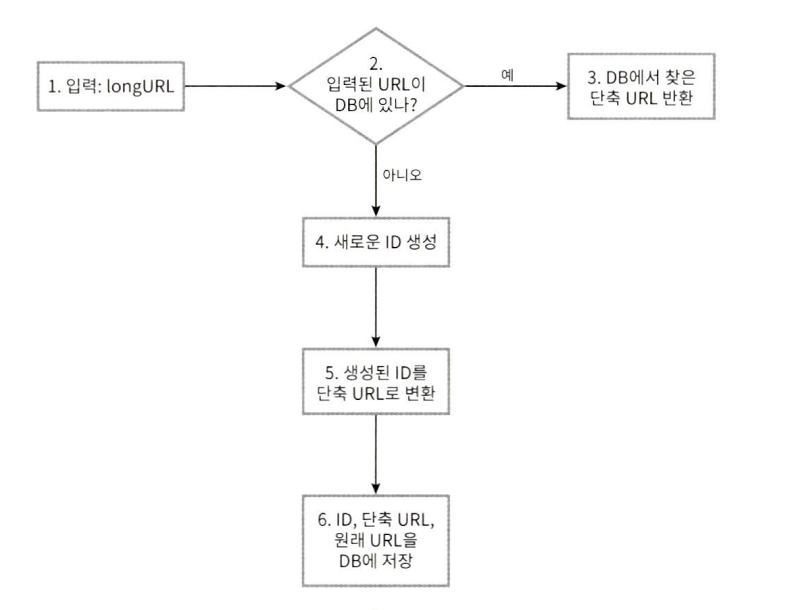
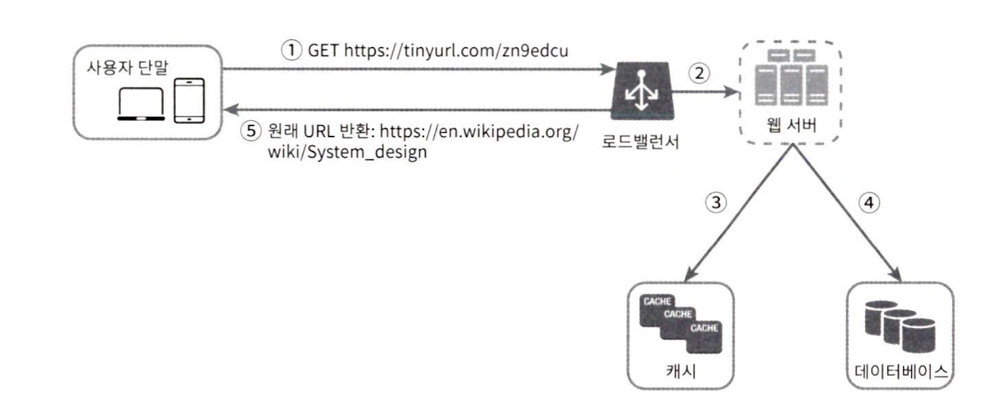

# 8장 URL 단축기 설계
## 1단계 문제 이해 및 설계 범위 확정
**요구사항**
1. URL 단축: 주어진 긴 URL을 훨씬 짧게 줄인다.
2. URL 리디렉션: 축약된 URL로 HTTP 요청이 오면 원래 URL로 안내
3. 높은 가용성과 규모 확장성, 장애 감내 요구

### 개략적 추정
- 쓰기 연산: 매일 1억 개의 단축 URL 생성
- 초당 쓰기 연산: 1억(100million) / 24 / 3600 = 1160
- 읽기 연산: 읽기와 쓰기 비율이 10:1이라 가정한다면 읽기 연산은 초당 11,600회
- URL 단축 서비스를 10년 운영하면 1억 x 365 x 10 = 3650억 개의 레코드 보관
- 축약 전 URL의 평균 길이는 100이라고 가정
- 10년 동안 필요한 저장 용량은 3650억 x 100바이트 = 36.5TB

## 2단계 개략적 설계안 제시 및 동의 구하기
### API 엔드포인트
1. URL 단축용 엔드포인트: 긴 url을 -> 짧은 url로 변환
	1. POST /api/v1/data/shorten {longUrl: longURLString}
	2. 반환: 단축 url
2. URL 리디렉션용 엔드포인트: 단축 url에 대해 http 요청이 온다면 원래 URL로 보내주는 용도
	1. GET /api/v1/shorUrl
	2. 반환: HTTP 리디렉션 목적지가 될 원래 URL

### URL 리디렉션
단축 URL로 요청이 들어오면 서버는 301코드와 함께 Location 헤더에 원래URL을 설정한 후 응답한다.
- 301: HTTP 요청의 처리 책임이 영구적으로 Location 헤더에 반환된 URL로 이전되었다는 뜻. 브라우저는 이 응답을 캐시 후 추후 같은 URL 요청을 보낼 때 캐시된 값을 사용
	- 서버의 부하 감소
- 302: 책임이 일시적으로 Location 헤더에 반환. 클라이언트는 같은 URL 요청을 보낼 때 매번 서버에 요청
	- 트래픽 분석 등에 용의

### URL 단축
긴 URL을 해시값으로 대응 시킬 함수 f(x)의 요구사항
- 긴 URL이 다른 값이면 해시 값도 달라야 한다.
- 계산된 해시 값은 원래 URL으로 복원 가능해야 한다.

## 3단계 상세 설계
### 데이터 모델
방법1: 해시 테이블에 모든 데이터를 두기
- 단점: 메모리는 유한하며 비싸다.
더 나은 방법: <단축 URL, 원래 URL> 순서쌍을 관계형 데이터베이스에 저장

###  해시 함수
해시 값 길이 
hashValue[0-9, a-z, A-Z]의 문자들. 사용할 수 있는 문자 개수는 62개. 62^n >= 3650억인 최소 n 값을 찾아야 한다.
n=7이면 약 3.5조 개의 URL을 만들 수 있으므로 요구사항을 만족하므로 hashValue의 길이는 7로 설정.
**해시 함수** 구현에 쓰일 기술 두 가지
- 해시 후 충돌 해소
- base-62 변환 법

### 해시 후 충돌 해소
| 해시 함수 | 해시 결과                                    |
| ----- | ---------------------------------------- |
| CRC32 | 5cb54054                                 |
| MD5   | 5a62509a84df9ee03fel230b9df8b84e         |
| SHA-1 | 0eeae7916c06853901d9ccbefbfcaf4de57ed85b |
문제상황: 가장 짧은 해시 값도 길이 7을 초과
해결방법: 해시 값에서 처음 7개 글자만 이용. 충돌이 일어난다면 해소될 때 까지 사전에 정한 문자열을 해시 값에 추가
단점: 단축 URL을 생성할 때 한 번 이상 데이터베이스 질의를 하므로 큰 오버헤드 발생

### base-62 변환
0은 0, 9는 9, 10은 a, 11은 b, .., 35는 z로, 36은 A, ..61은 Z로 대응

### 두 접근법 비교
| 해시 후 충돌 해소 전략                               | base-62 변환                                      |
| ------------------------------------------- | ----------------------------------------------- |
| 단축 URL 길이 고정                                | 단축 URL 길이가 가변적                                  |
| 유일성이 보장되는 ID 생성기 미필요                        | 유일성 보장 ID 생성기 필요                                |
| 충돌 가능성으로 인한 해소 전략 필요                        | ID의 유일성이 보장된 후 전략이라 충돌 불가능                      |
| ID로부터 단축URL 계산하는 것이 아닌 다음 사용가능한 URL을 알아내는 것 | ID가 1씩 증가하는 값이라 가정하면 추후 URL을 알아낼 수 있어 보안상 문제 발생 |

### URL 단축기 상세 설계

### URL 리디렉션 상세 설계

## 4단계 마무리
**추가 논의할 수 있는 사항**
- 처리율 제한 장치: 많은 양의 URL 단축 요청이 들어올 경우 무력화 가능성. 이 때 rate limiter 사용 고려
- 웹 서버의 규모 확장: 본 설계는 무상태 계층이여서 웹 서버의 증설/삭제 자유롭게 가능
- 데이터베이스의 규모 확장: 데이터베이스 다중화 또는 샤딩
- 데이터 분석 솔루션: 어떤 링크를 얼마나 많은 사용자가 클릭했는지 확인이 필요할 경우 데이터 분석 솔루션 사용 가능
- 가용성, 데이터 일관성, 안정성