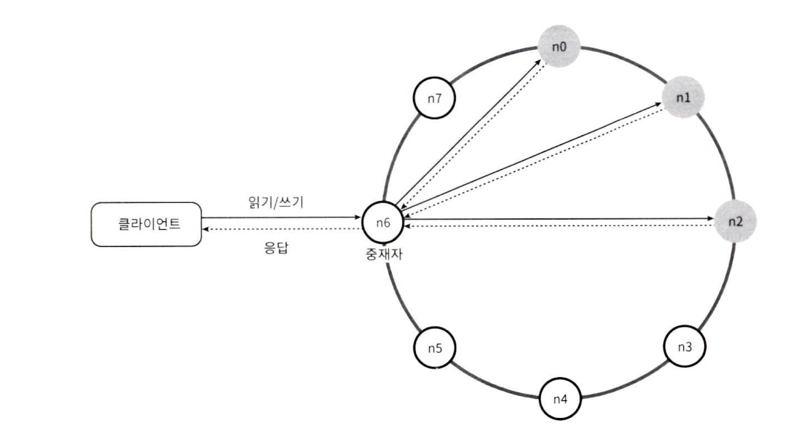
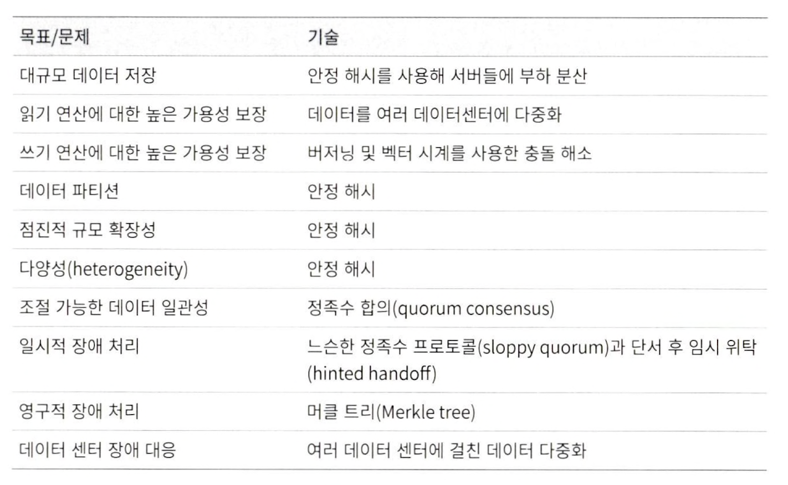

# 6장 키-값 저장소 설계
키-값 저장소는 키-값 데이터베이스라고도 불리는 비 관계형 데이터 베이스
키는 유일하며, 값은 키를 통해서만 접근할 수 있다.
값은 문자열, 리스트, 객체 등 어떠한 타입이든 상관없다.
## 문제 이해 및 설계 범위 확정
- 키-값 쌍의 크기는 10KB 이하
- 큰 데이터 저장 가능
- 높은 가용성 제공
- 높은 규모 확장성 제공, 트래픽 양에 따라 자동 증설/삭제
- 데이터 일관성 수준 조정 가능
- 짧은 응답 지연시간

## 단일 서버 키-값 저장소
직관적인 방법: 키-값 쌍 모두 메모리에 해시테이블로 적재
개선책
- 데이터 압축
- 자주 쓰이는 데이터만 메모리에 두고 나머지는 디스크에 저장

## 분산 키-값 저장소
#### CAP 정리
일관성, 가용성, 파티션 감내  세 가지 요구사항을 동시에 만족하는 분산 시스템은 설계 불가.
- **데이터 일관성**: 모든 클라이언트는 언제나 같은 데이터를 보아야 함.
- **가용성**: 일부 노드에 장애가 발생해도 항상 응답을 받을 수 있음
- **파티션 감내**: 두 노드 사이에 통신 장애 발생. 네트워크에 파티션이 생겨도 시스템은 동작해야 함.
#### 시스템 분류
- **CP 시스템**: 가용성 희생
- **AP 시스템**: 데이터 일관성 희생
- **CA 시스템**: 파티션 감내 희생. 실세계에 존재하지 않음. (네트워크 장애는 피할 수 없는 것으로 보기 때문)
#### 이상적 상태
네트워크가 파티션되는 상황이 절대로 일어나지 않아 일관성과 가용성도 만족.
#### 실세계의 분산 시스템
파티션 문제가 발생하면 CA, AP 중 선택을 해야함. 일관성이냐 가용성이냐
ex. 은행에서는 보통 일관성을 선택함. 그래서 쓰기 연산을 중단하여 오류를 반환. 가용성을 선택한다면 계속 읽기 연산을 허용하며, 인입된 쓰기 연산을 추후 문제해결된 서버에 전송.
### 시스템 컴포넌트
키-값 저장소 구현에 사용될 핵심 컴포넌트 및 기술
- 데이터 파티션
- 데이터 다중화
- 일관성
- 일관성 불일치 해소
- 장애 처리
- 시스템 아키텍처 다이어그램
- 쓰기 경로
- 읽기 경로
#### 데이터 파티션
- 데이터를 고르게 분산할 수 있어야 하며
- 데이터의 이동을 최소화 해야한다.
안정해시, 해시링을 사용하여 파티션 해결

장점
- 규모 확장 자동화: 시스템 부하에 맞게 자동으로 서버 증설/삭제
- 다양성: 각 서버의 용량에 맞게 가상 노드 조정 가능.
#### 데이터 다중화
높은 가용성과 안정성 확보를 위해 데이터를 N개 서버에 비동기적으로 다중화 해야함.
#### 데이터 일관성
정족수 합의(Quorum Consensus) 프로토콜을 사용하여 읽기/쓰기 연산 일관성 보장.
정족수 합의에 관계된 정의
- N = 사본 개수
- W = 쓰기 연산에 대한 정족수, 적어도 W개의 서버로부터 응답을 받아야 쓰기 연산 성공으로 간주.
- R = 읽기 연산에 대한 정족수, 적어도 R개의 서버로부터 응답을 받아야 읽기 연산 성공으로 간주.

**N, W, R 구성을 통한 서버 구성**
- R = 1, W = N: 빠른 읽기 연산 최적화된 시스템
- R = N, W = 1: 빠른 쓰기 연산 최적화된 시스템
- W + R >= N :  강한 일관성이 보장됨 (보통 N = 3, W = R = 2)
- W + R <= N : 강한 일관성이 보장되지 않음

**일관성 모델**
- 강한 일관성: 모든 읽기 연산이 가장 최근 갱신된 결과를 반환
- 약한 일관성: 읽기 연산은 가장 최근 갱신된 결과를 반환받지 못할 수 있음
- 결과적 일관성: 약한 일관성의 한 형태, 갱신 결과가 결국 모든 사본에 반영(동기화) 되는 모델

**비 일관성 해소 기법: 데이터 비저닝**
데이터 다중화시 가용성은 높아지지만 사본간 일관성이 깨질 가능성 존재. 이 문제를 **버저닝**과 **벡터 시계**로 해소할 수 있다.

#### 장애처리
대규모 시스템에서는 장애를 감지하고 해소하는 것이 중요하다.

**장애감지**
**가십 프로토콜** 같은 분산형 장애 감지 솔루션이 효율적이다.
가십 프로토콜의 동작 원리
- 각 노드는 멤버십 목록을 유지. 멤버십 목록은 각 멤버 ID와 박동 카운터 쌍.
- 각 노드는 주기적으로 자신의 박동 카운터를 증가
- 각 노드는 무작위로 선정된 노드들에게 주기적으로 자기 박동 카운터 목록을 전송.
- 박동 카운터 목록을 받은 노드는 멤버십 목록을 최신 값으로 갱신.
- 어떤 멤버의 박동 카운터 값이 지정된 시간 동안 갱신되지 않을 시 해당 멤버는 장애 상태인것으로 간주.

**일시적 장애 처리**
장애 상태인 서버로 가는 요청을 다른 서버가 처리 후, 해당 서버가 복구되었을 시 다른 서버는 저장해놓은 힌트를 복구된 서버로 전송.

**영구 장애 처리**
영구적인 노드의 장애 상태 처리 방법은?
반-엔트로피 프로토콜을 구현하여 사본들을 동기화
일관성이 망가진 상태는 머클트리를 통해 감지.
머클트리: 루트노드의 값을 기반으로 데이터를 검증하는데 노드들은 각 리프노트의 해시값을 가지고 있다. 결국 각 서버의 머클트리 최종루트노드 값이 서로 다른 경우 해당 버킷들만 동기화하면 된다.

#### 시스템 아키텍처 다이어그램
- 클라이언트는 키-값 저장소가 제공하는 get, put 두 가지 API로 통신
- 중재자(coorinator)는 키-값 저장소에 대한 프락시 노드
- 노드는 안정 해시의 해시 링 위에 분포
 

#### 쓰기 경로
1. 쓰기 요청이 커밋 로그 파일에 기록
2. 데이터가 메모리 캐시에 기록
3. 메모리 캐시가 가득 차거나 임계치를 넘으면 디스크에 있는 SSTable에 기록.
#### 읽기 경로
1. 데이터가 메모리에 있는지 검사. 없다면 2로 간다.
2. 데이터가 메모리에 없으므로 블룸 필터를 검사
3. 블룸 필터를 통해 어떤 SSTable에 키가 보관되어 있는지 확인
4. SSTable에서 데이터를 추출
5. 해당 데이터를 클라이언트에 반환
## 요약
