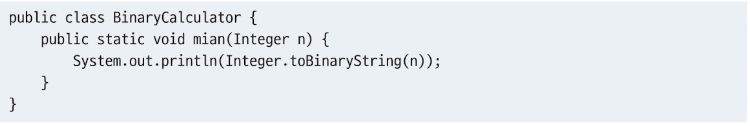
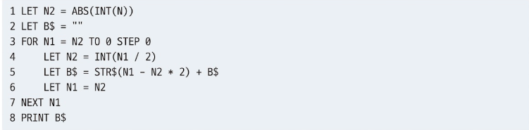
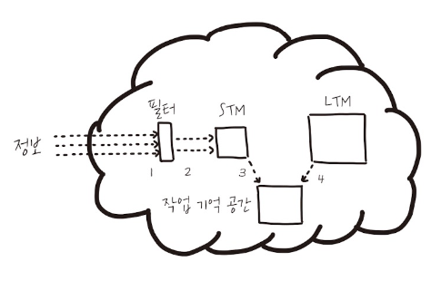

# 1장 코딩 중 겪는 혼란에 대한 이해
- 프로그래밍을 하다보면 항상 혼란 발생
- 잠시의 혼란은 문제가 되지 않지만, 필요 이상으로 오래 가져가는 것은 금물

## 1.1 코드가 초래하는 세 가지 종류의 혼란
아래 세 가지 예제 코드를 읽을 때 뇌가 서로 다르게 동작하는 것을 느낄 수 있음
- APL 코드 
  - 
- Java 코드 
  - 
- Basic 코드 
  - 

### 1.1.1 혼란의 첫 번째 유형: 지식의 부족
- APL 코드를 보고 혼란스러운 이유
  - T가 의미하는 바를 모르기 때문
  - 즉, T에 대한 **지식**(knowledge)이 없기 때문

### 1.1.2 혼란의 두 번째 유형: 정보의 부족
- 자바 코드를 보고 혼란스러운 이유
  - toBinary() 메서드가 내부적으로 어떻게 작동하는지 모르기 때문
  - 즉, 이 메서드에 대한 **정보**(information)가 부족하기 때문 

### 1.1.3 혼란의 세 번째 유형: 처리 능력의 부족
- 베이직 코드를 보고 혼란스러운 이유
  - 각각의 단계가 실행되는 것을 한눈에 파악할 수 없기 때문 
  - 즉, **처리 능력**(processing power)이 부족하기 때문
 
**정리하면 아래와 같은 경우 혼란을 초래**
1. 프로그래밍 언어나 알고리즘 혹은 업무 영역에 대한 지식이 없는 경우
2. 코드를 이해하기 위해 필요한 정보가 충분히 없는 경우
3. 코드가 너무 복잡한 경우

## 1.2 코딩에 영향을 주는 인지 과정
- 지식이 없다는 것은 두뇌의 **장기 기억 공간**(long-term memory, LTM)에 해당 내용이 없다는 뜻
- 지식이 아닌 어떤 정보가 부족하다는 것은 **단기 기억 공간**(short-term memory, STM)에 해당 내용이 없다는 뜻
- 많은 정보를 처리할 때는 **작업 기억 공간**(working memory)에 영향을 미침

**요약**
- 지식의 부족 = LTM의 문제
- 정보의 부족 = STM의 문제
- 처리 능력의 부족 = 작업 기억 공간의 문제

### 1.2.1 LTM과 프로그래밍
- LTM에 존재하는 기억은 아주 오랫동안 보관
- LTM은 어떤 기술을 성공적으로 적용한 순간, 자바 언어에서의 키워드 의미, 영어 단어의 의미 등의 정보를 저장
- 컴퓨터의 하드 드라이브와 유사

### 1.2.2 STM과 프로그래밍
- STM은 들어오는 정보를 잠시 보관
- 코드 분석시 키워드, 변수명, 자료구조 등이 STM에 일시적으로 저장
- LTM은 우리가 행하는 모든 인지 과정에 관여
  - 때문에 자바 예제 코드를 읽을 때는 STM뿐만 아니라 LTM 역시 사용
- STM은 값을 일시적으로 저장하는 캐시나 메인 메모리

### 1.2.3 작업 기억 공간과 프로그래밍
- STM과 LTM은 기억장치라고 할 수 있음
- 실제 사고 작용이 일어나는 곳은 작업 기억 공간
- 작업 기억 공간은 두뇌의 프로세서와 유사
- LTM과 STM에서 정보를 가져와 작업 기억 공간에서 처리
- **트레이싱**: 우리 머리가 코드를 실행해보며 무슨 일이 일어날지 이해하려 시도하는 과정(머릿속에서 코드를 컴파일하고 실행하는 과정)

## 1.3 인지 과정들의 상호작용
### 1.3.1 인지 과정들이 어떻게 상호작용하는지에 대한 간단한 설명

우리가 사고할 때는 위 세 가지 인지 과정 모두 어느 정도 활성화
1. 두뇌로 정보가 들어옴
2. STM에 정보가 들어옴
3. STM에서 작업 기억 공간으로 정보가 이동
4. 3과 동시에 LTM에서 작업 기억 공간으로 정보 이동

### 1.3.2 프로그래밍 업무와 관련한 인지 과정
- 예를 들어 버그 리포트를 받는 상황
  - 몇 개월 전에 작성한 코드를 다시 읽어야 하는 상황
  - STM에 저장된 새로운 버그 리포트 내용, LTM에 저장된 유사한 버그의 해결법이나 개인적인 기억 모두 작업 기억 공간으로 이동하여 문제에 대해 처리
