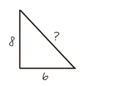
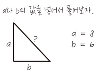

# 4장 복잡한 코드 읽는 방법

## 4.1 복잡한 코드를 이해하는 것이 왜 어려울까?
**작업 기억 공간과 STM의 차이**
- 작업 기억 공간은 문제에 적용된 STM 라고 할 수 있다
- 작업 기억 공간도 STM 처럼 제한이 있다
- 한 번에 2개에서 6개까지만 기억할 수 있다
  - 작업 기억 공간의 맥락에서 이 용량을 **인지 부하** 라고한다
  - 청크로 나뉘지 않는 문제를 풀려고 하면 **과부하** 상태가 된다

**프로그래밍과 관련한 인지 부하의 종류**
인지부하의 종류
- **내재적 부하**: 문제 자체가 얼마나 복잡한지
- **외재적 부하**: 외부적 요인에 의해 문제에 추가된 것
- **본유적 부하**: 생각을 LTM에 저장하는 과정에서 일어나는 인지 부하

예제
- 내재적 인지부하: 
  - 피타고라스 정리를 알고 있어야 문제가 풀린다
  - 문제 자체가 갖고 있는 특성 때문에 발생하는 인지부하다
  - 
- 외재적 인지부하
  - 내재적인 부하에 더해서 문제에 추가되는 인지 부하
  - 피타고라스 정리에 더해 변수를 a,b와 비에 연결시켜야 하는 추가작업
  - 